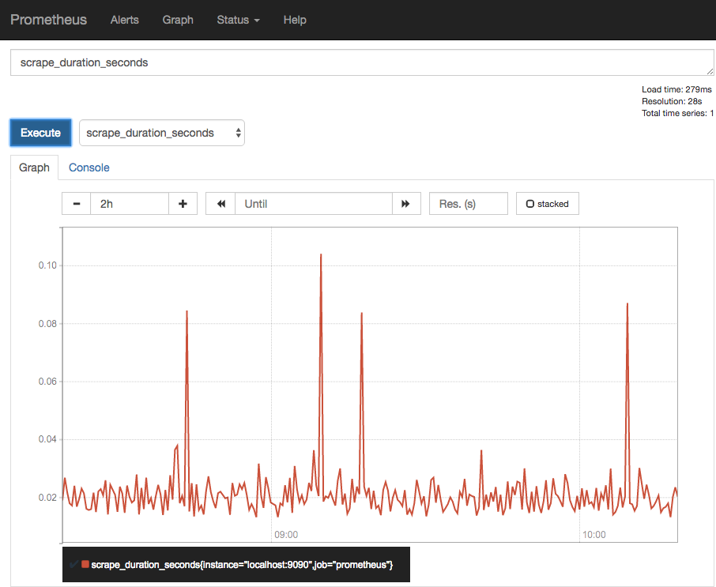
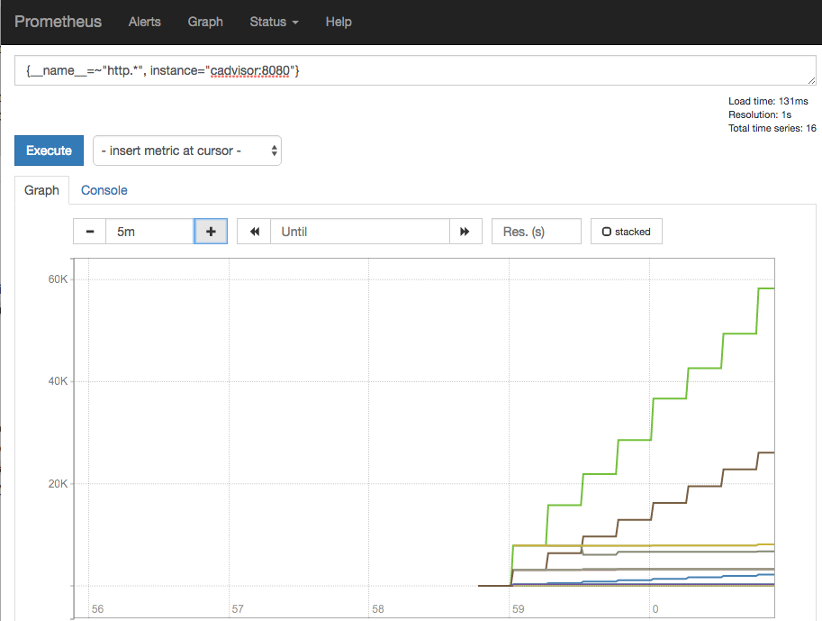

Prometheus
==========

If you need to collect metrics from your application you could do that using http://prometheus.io

Installation of prometheus
--------------------------

1. Install prometheus using ``oc new-app prom/prometheus``
2. If you want the metrics to be public you can expose prometheus' Web-GUI using ``oc expose service prometheus``, or you can build an authenticating web-proxy in front of it, or access it using ``oc port-forward``.
3. I choose to configure prometheus using an ConfigMap (https://docs.openshift.com/container-platform/latest/dev_guide/configmaps.html#configmaps-restrictions)::
cat << EOF | oc create -f -
apiVersion: v1
data:
  prometheus.yml: |
    global:
      scrape_interval: 15s
      evaluation_interval: 15s
      external_labels:
        monitor: 'codelab-monitor'
    scrape_configs:
    - job_name: prometheus
      scrape_interval: 15s
      scrape_timeout: 10s
      metrics_path: /metrics
      scheme: http
      static_configs:
      - targets:
        - localhost:9090
kind: ConfigMap
metadata:
  creationTimestamp: null
  name: prometheus-config
EOF

4. You can add more targets to this config file, see below for an example
5. mount the configmap as a volume into the pod: this is the easiest to do in the yaml on the CLI: ``oc edit dc/prometheus``
6. look for "volumes:", there is already a "prometheus-volume-1", change it to::
volumes:
- emptyDir: {}
  name: prometheus-volume-1
- configMap:
    name: prometheus-config
  name: prometheus-config-1
7. look for "volumeMounts:", change it to::
volumeMounts:
- mountPath: /prometheus
  name: prometheus-volume-1
- mountPath: /etc/prometheus
  name: prometheus-config-1
8. Save the deploymentconfig
9. Add a persistent volume to save the metrics. First get a volume claim e.g. through the Web-GUI: Storage -> Create Storage, name: prometheus-data, Single User (RWO), Size: e.g. 1GB
10. Then mount that into the prometheus-pod. Because there is already an "emptyDir" ephemeral volume from the docker image definition we need to overwrite that: ``oc volumes dc/prometheus --add --overwrite --name=prometheus-volume-1 --type=persistentVolumeClaim --claim-name=prometheus-data``
11. Since prometheus does not expect multiple instances to run on the same data directory (=volume) we should change the deployment configuration from "Rolling" (start the new version, then remove the old version) to "Recreate" (first shut down the old version, then start the new version) e.g. through the Web-GUI: Menu Applications -> Deployments -> prometheus, on the top-right "Actions" -> Edit, change Deployment Strategy, Strategy Type: Recreate
12. You can now access prometheus and see the metrics prometheus gathers from itself

Example Metrics from cadvisor
-----------------------------

Cadvisor is a small application that exports metrics from its environment that I'll use to demonstrate how to add a metric source to prometheus

1. install cadvisor with ``oc new-app google/cadvisor``
2. since prometheus can use the internal service name you don't need to expose the service publicly. If you want to have a look anyways you can expose the service with ``oc expose service cadvisor``
3. update the prometheus configMap to include the internal service name of cadvisor to scrape::
cat << EOF | oc replace -f -
apiVersion: v1
data:
  prometheus.yml: |
    global:
      scrape_interval: 15s
      evaluation_interval: 15s
      external_labels:
        monitor: 'codelab-monitor'
    scrape_configs:
    - job_name: prometheus
      scrape_interval: 15s
      scrape_timeout: 10s
      metrics_path: /metrics
      scheme: http
      static_configs:
      - targets:
        - localhost:9090
    - job_name: cadvisor
      static_configs:
      - targets:
        - cadvisor:8080
kind: ConfigMap
metadata:
  creationTimestamp: null
  name: prometheus-config
EOF

4. re-deploy prometheus for it to pick up the config change: ``oc deploy prometheus --latest``
5. you now have a lot of metrics to look at ;)

