Unifi-Controller
================

To manage Ubiquiti UniFi Wifi- and Networking devices you can deploy your own Network Management Controller.

There is a readily available docker image (https://hub.docker.com/r/jacobalberty/unifi/) containing both the UniFi Software and MongoDB Database running as non-root.

To deploy this with a proper SSL certificate follow these easy steps:

1. Log in to https://console.appuio.ch/ and choose your project you want to deploy your controller in
2. Choose "Add to project" at the top-right and "Deploy Image" in the menu
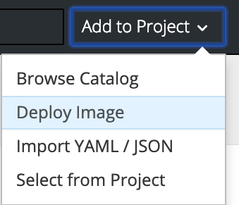
4. Enter "jacobalberty/unifi:latest" in the Image Name and click the magnifying glass button on the right
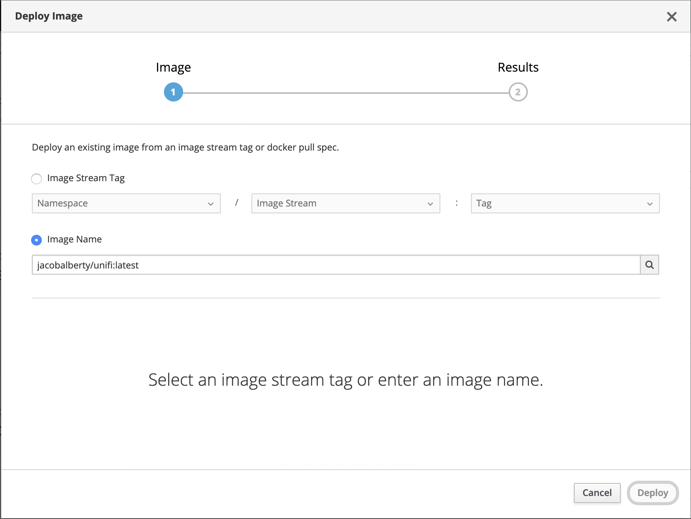
5. You can customize the Name if you want to, I'll use the default "unifi" name
6. Set the following environment variables::

   BIND_PRIV=false
   RUNAS_UID0=false
   JVM_MAX_THREAD_STACK_SIZE=1280k
   TZ=Europe/Zurich (or whatever your timezone is)

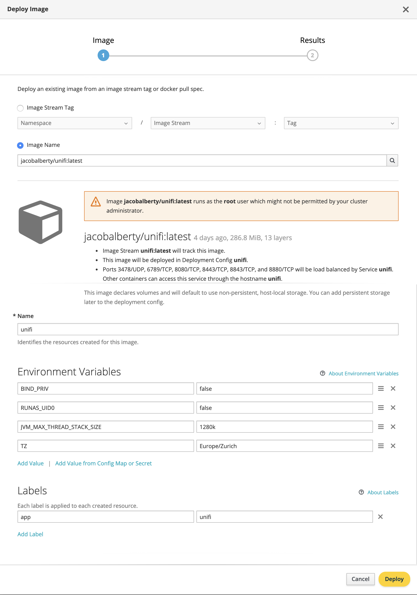
7. Click "Deploy" and then "Close"
8. Open the newly created Deployment Configuration, e.g. via Applications -> Deployments -> unifi -> Configuration
9. Choose "Actions" -> "Pause Rollouts"
.. image:: unifi4.png
10. Choose "Actions" -> "Edit"
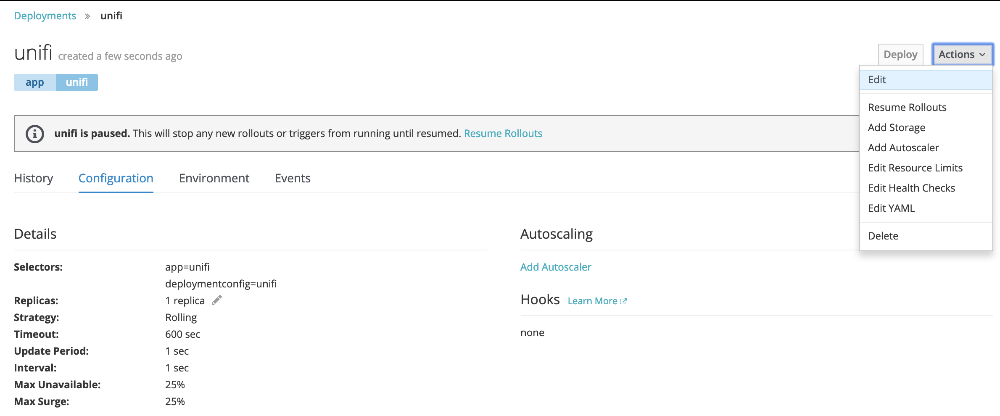
11. Set the deployment strategy type to "Recreate", acknowledge the popup and Save at the bottom
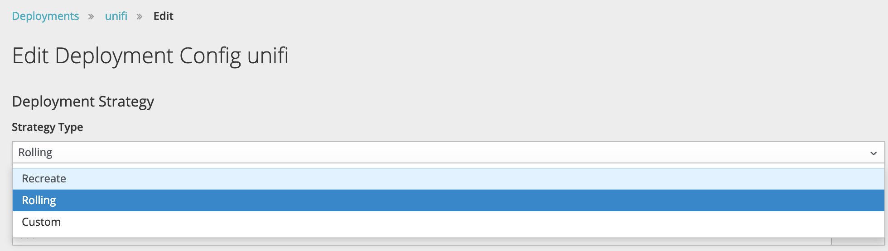
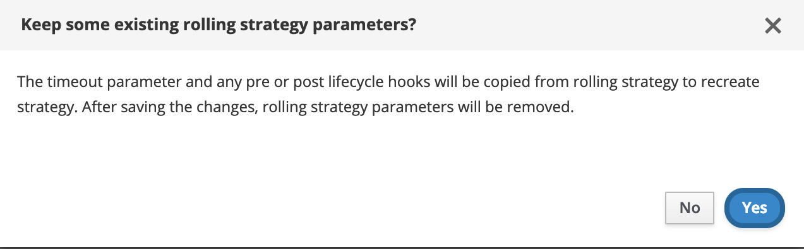
12. back in the Configuration Tab: delete the "unifi-1" storage volume
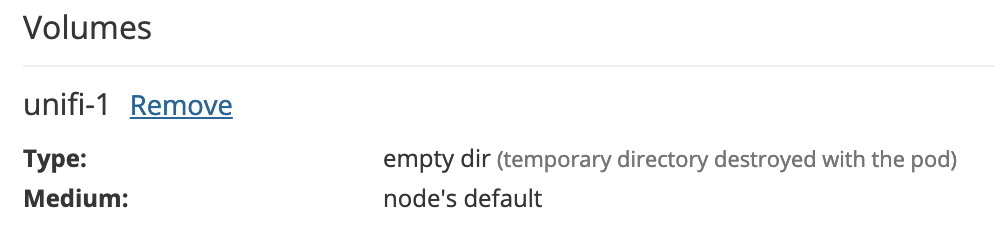
13. Choose "Actions" -> "Add storage"
14. If you already have a persistent volume created for the unifi controller choose it here, or click "create storage" to create a new one
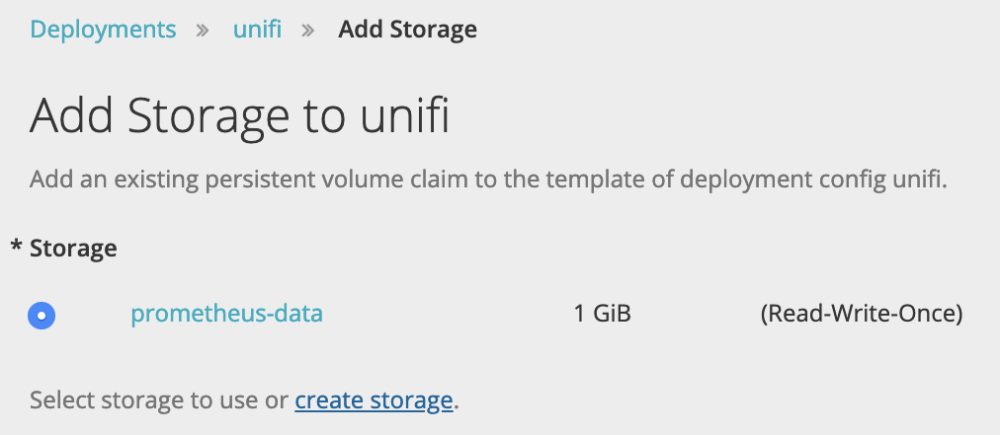
15. I chose the name "unifi" and size "10" GB, continue with "Create"
.. image:: unifi10.png
16. back in the volume dialog: set mount path "/unifi" and volume name "unifi-1", then "Add"
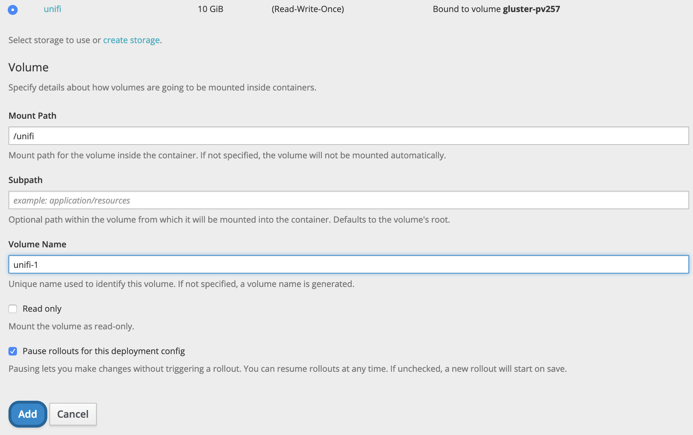
17. Choose "Actions" -> "Edit Resource Limits"
18. Set CPU Request: 100, Limit: 500 and RAM Requiest: 200, Limit: 500
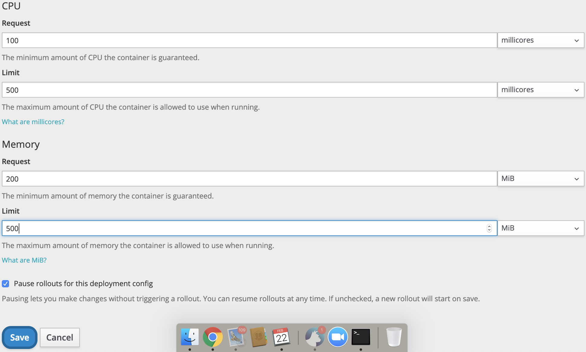
19. Choose "Actions" -> "Edit Health Checks"
20. Add both readiness and liveness probes with Type: HTTP, Use HTTPS, Port 8443, Initial Delay 30s
.. image:: unifi13.png
21. Resume rollouts
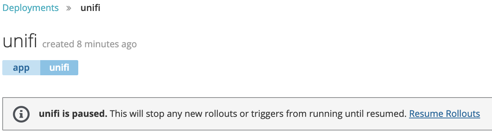
22. Wait until the deployment rollout is done
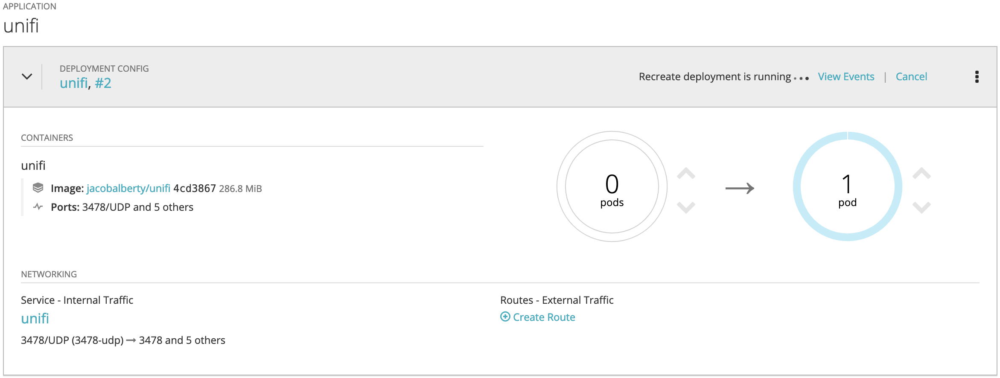
23. the controller will have created a new, self-signed SSL-certificate on first start. We have to get this certificate to trust it. I used the CLI-Tools for this: copy login command on the top-right
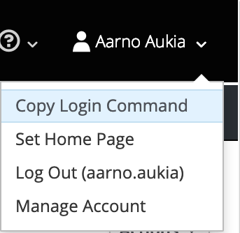
24, paste the login command into a Terminal window, then `oc get pods -l app=unifi` to get the pod name and `oc port-forward unifi-2-4jm9g 8443:8443` (substituting your pod name in the command) to open a connection from your computer to the running unifi controller instance
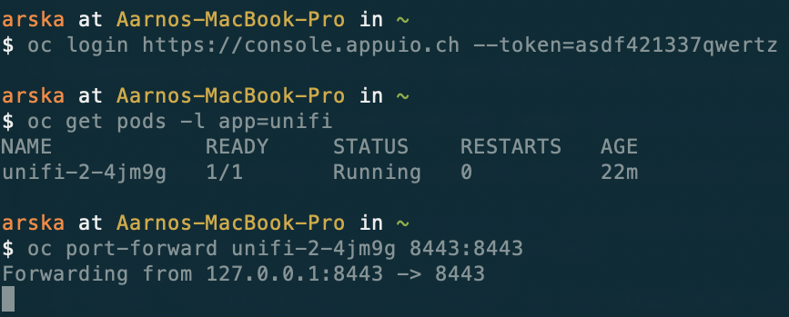
25. open another Terminal window and enter `openssl s_client -connect 127.0.0.1:8443` to connect to the pod and output the SSL-certificate. Copy the certificate (all the lines from "-----BEGIN CERTIFICATE" up to and includiniig "-----END CERTIFICATE-----") from the output
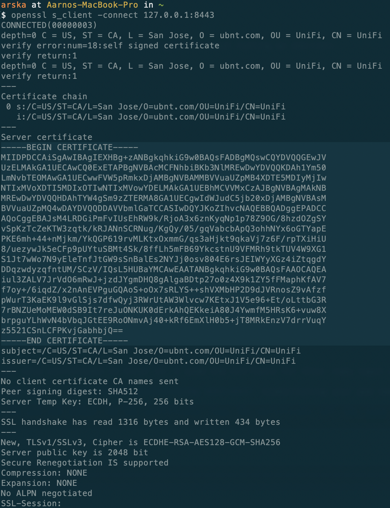
26. Open "Applications" -> "Routes" and "Create Route" from the top-left.
27. I named the new route "unifi", entered the hostname my controller should be reachable at in the end ("arskacontroller.appuioapp.ch"), selected the Service "unifi", Port 8443, Enable Security, TLS-Termination "Re-encrypt", Insecure "Redirect" and paste the copied certificate from above in the "Destination CA Certificate" field. Then click "Create".
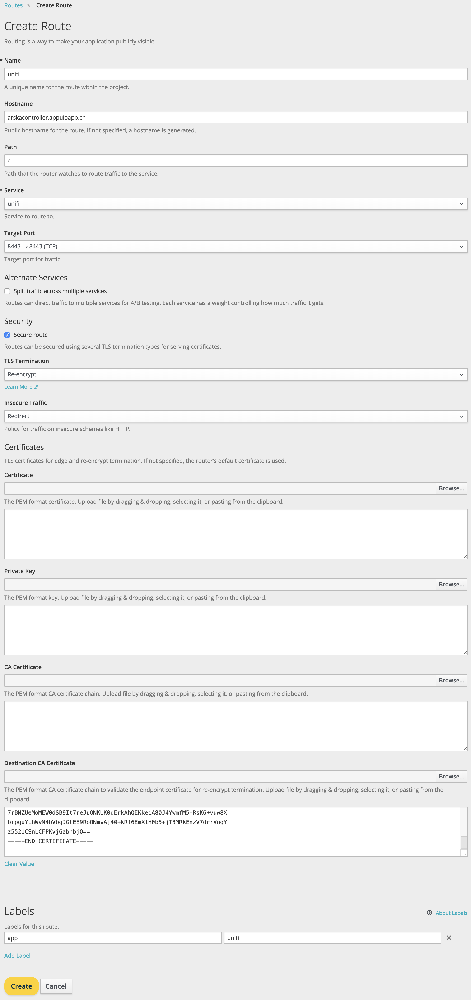
28. The access-points I bought were running firmware 3.7.58.6385. To connect ("adopt" or "inform") these to the controller another route without SSL is needed: "Create route", Name "unifi-inform", Hostname "arskainform.appuioapp.ch", Service "unifi", Port "8080". For access-points with firmwarre >4 this is not necessary.
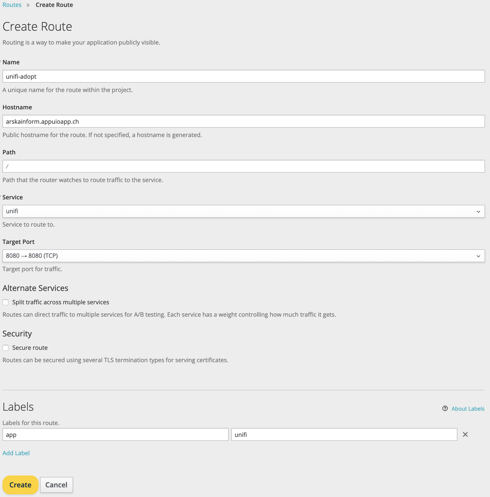
29. we can connect to the controller to do the setup wizard using the first route created, https://arskacontroller.appuioapp.ch in my case
30. To connect a access-point with firmware version 3.x/4.x: ssh ubnt@ip-address-of-ap, password ubnt, `set-inform http://arskainform.appuioapp.ch/inform`
31. To connect a access-point with firmware version 4.x: ssh ubnt@ip-address-of-ap, password ubnt, `set-inform https://arskacontroller.appuioapp.ch/inform`
32. in both cases the access-point appears as "pending adoption" in the devices tab on the controller. Click "adopt and upgrade".
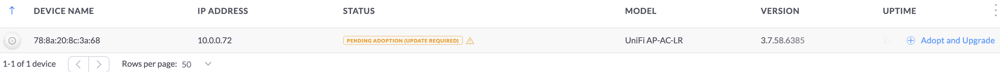
33. to finish the process issue the `set-inform` command above again. After a few seconds the status on the controller should change to "Upgrading". If not issue the set-inform command again, I used 1-3 times per access-point.
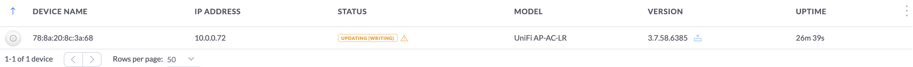
34. after upgrading and rebooting the access-point should be "connected"
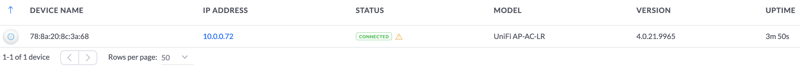
