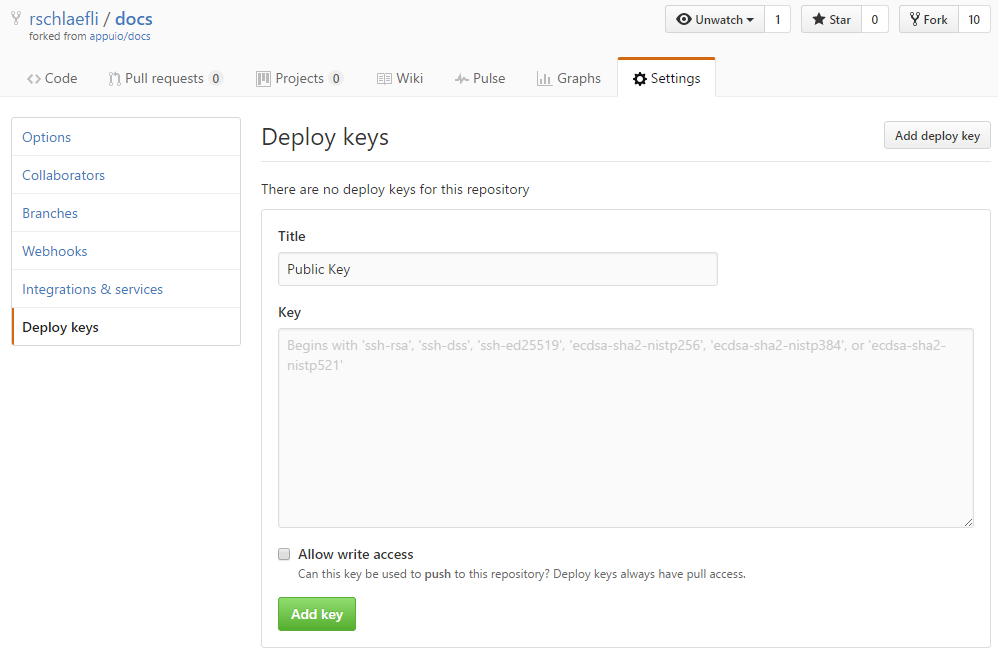
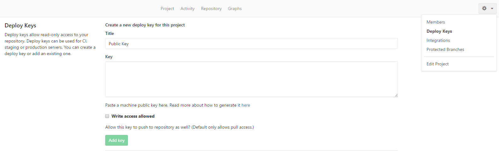
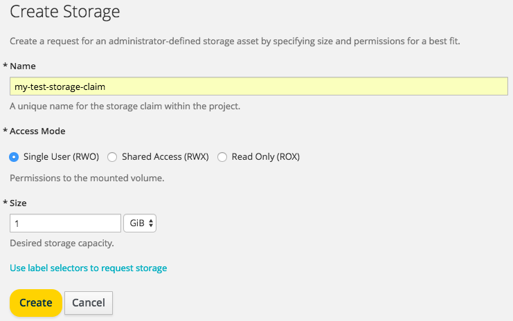
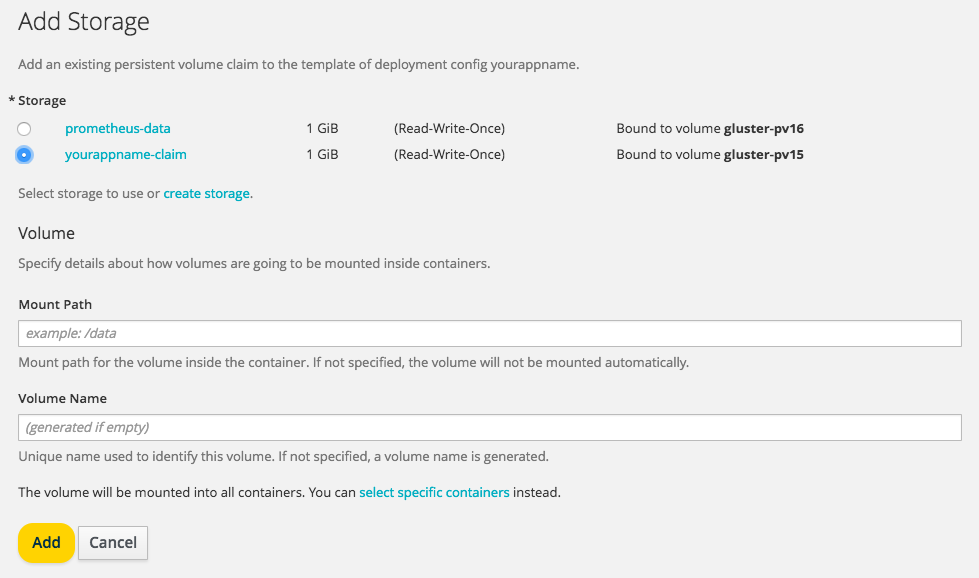

How Tos
=======

.. contents::

How to access the OpenShift registry from outside
-------------------------------------------------

To access the internal OpenShift registry from outside, you can use the
following example: ::

  oc login https://console.appuio.ch
  OCTOKEN=$(oc whoami -t)
  docker login -u MYUSERNAME -p $OCTOKEN registry.appuio.ch
  docker pull busybox
  docker tag busybox registry.appuio.ch/MYPROJECT/busybox
  docker push registry.appuio.ch/MYPROJECT/busybox
  oc get imagestreams -n MYPROJECT

How to run scheduled jobs on APPUiO
-----------------------------------

checkout the `APPUiO Cron Job
Example <https://github.com/appuio/example-cron-traditional>`__

How to access an internal service while developing
--------------------------------------------------

E.g. accessing a hosted PostgreSQL on port 5432 while developing locally.

To access a service (a single pod, to be more specific) from your local machine, make sure you have installed the OpenShift CLI (as described in the `official documentation <https://docs.openshift.org/latest/cli_reference/get_started_cli.html>`__).

Login to the OpenShift CLI:

::

  $ oc login

Get a list of your currently running pods:

::

  $ oc get pods
  NAME                         READY     STATUS      RESTARTS   AGE
  play-postgres-1-9ste1        1/1       Running     0          9s

With the name of the pod running your service, run the ``oc port-forward`` command, also specifying the **port** you would like to access:

::

  $ oc port-forward play-postgres-1-9ste1 5432
  Forwarding from 127.0.0.1:5432 -> 5432
  Forwarding from [::1]:5432 -> 5432

Your service may now be accessed via ``localhost:port``. For more advanced usage of ``oc port-forward`` consider the `official documentation <https://docs.openshift.org/latest/dev_guide/port_forwarding.html>`__.

How to use a private repository (on e.g. Github) to run S2I builds
------------------------------------------------------------------

1. Create an SSH keypair
^^^^^^^^^^^^^^^^^^^^^^^^

Create an SSH keypair **without passphrase**::

  $ ssh-keygen -t rsa -b 4096 -C "your_email@example.com"
  Generating public/private rsa key pair.
  Enter file in which to save the key: id_rsa
  Enter passphrase (empty for no passphrase):
  Enter same passphrase again:
  Your identification has been saved in id_rsa.
  Your public key has been saved in id_rsa.pub.

The private key has been saved as ``id_rsa``, the public key as ``id_rsa.pub``. You will need both of them, store them in a secure location.

2. Create a deploy key
^^^^^^^^^^^^^^^^^^^^^^

To allow the newly generated key to pull your repository, you have to specify the public key as a deploy key for your project. This can be done as shown below:

GitHub
""""""

Gitlab
""""""

For OpenShift to be able to access a private repository, the Gitlab instance needs to be configured for SSH access.

3. Save the private key in an OpenShift secret
^^^^^^^^^^^^^^^^^^^^^^^^^^^^^^^^^^^^^^^^^^^^^^

Add a new ssh secret to your OpenShift project, specyfing the path of your ssh private key::

  oc secrets new-sshauth sshsecret --ssh-privatekey=id_rsa

A new secret called ``sshsecret`` has been added. In order to allow OpenShift to pull your repository, the newly saved secret also has to be linked to the builder service account::

  oc secrets link builder sshsecret

A more detailed explanation of this step can be found in the `official documentation <https://docs.openshift.org/latest/dev_guide/builds.html#ssh-key-authentication>`__.

4. Create a new build config in OpenShift
^^^^^^^^^^^^^^^^^^^^^^^^^^^^^^^^^^^^^^^^^

Now that OpenShift knows your private key and the builder is able to use it, you can create a new S2I build configuration, specifying your private repository as a source.

Create a new build config using the following command (while in your project's directory with git remotes defined)::

  oc new-build s2i-builder-image~SSH_REPO_URL --name="new-bc"

The ``s2i-builder-image`` above specifies the S2I-builder image OpenShift is going to use to build your application source. ``SSH_REPO_URL`` should be replaced with the path of your repository, for example "git@gitlab.example.com:john/example_project.git".

As a final step, add the ``sshsecret`` to the newly created build config ``new-bc``::

  oc set build-secret --source bc/new-bc sshsecret

You should now be able to successfully run your source-to-image builds on OpenShift.

All of those steps are also explained in the `official documentation <https://docs.openshift.org/latest/dev_guide/builds.html#ssh-key-authentication>`__.

How to add a persistent volume to an application
------------------------------------------------

As you know, the contents of the pod/container is discarded when deploying a new container and not shared between concurrent application instances, so you need to save your application data either in a specific service (like S3 for files/object, a database for data, etc) or in a persistent volume that is attached to the container when started.

Create a volume from the Web-GUI
^^^^^^^^^^^^^^^^^^^^^^^^^^^^^^^^

Click in the Menu under "Storage", you'll find there all your existing Persistent Volume Claims. On the top-right there is the button to create a new claim.

1. set a unique name, e.g. yourappname-claim
2. choose if you need the volume only on one container (Single User) or simultaneously on multiple containers (Shared Access). A read-only volume can be used for special purposes, but you probably don't need one.
3. Enter a size, probably in GiB. This is the amount of storage that will be reserved for you and you will be billed on.
4. Click Create

You can then bind that claim to a deployment by clicking in the Menu Applications->Deployments, choosing your deployment, then below the Template and above the list of deployments there is the "Volumes" section with the "Add storage" option. Clicking that you can choose which claim to use, where inside the pod the volume should be mounted.

If your deployment/pod already has an "emptyDir" (=ephemeral) volume mounted (e.g. because you are deploying a docker image with a volume specified) you can replace that volume with your new claim using::

  oc volumes dc/yourappname --add --overwrite \
    --name=yourvexistingvolumename \
    --type=persistentVolumeClaim \
    --claim-name=yourappname-claim

How to customize the build image/process
----------------------------------------

I tried to build https://github.com/arska/sslinfo using the default python 3.5 builder though the Web-GUI. Unfortunately while installing my dependencies the following error message appeared that did not in my development environmen::

  Collecting cryptography==2.1.4 (from -r requirements.txt (line 5))
  Downloading cryptography-2.1.4.tar.gz (441kB)
  Complete output from command python setup.py egg_info:
  error in cryptography setup command: Invalid environment marker: platform_python_implementation != 'PyPy'

Quick googling pointed me to https://github.com/pyca/pyopenssl/issues/702 with the resolution being upgrading the pip and setuptools packages before installing the dependency.

My first reaction was to customize the assemble stage of the source-to-image (s2i) process to first upgrade the installers before installing dependencies. This can be customized by creating a shellscript at /s2i/bin/assemble in the git repo that will be used instead of the build process supplied one, as described at https://docs.openshift.com/container-platform/latest/using_images/s2i_images/customizing_s2i_images.html. As this is all open source I looked at the original (https://github.com/sclorg/s2i-python-container/blob/master/3.5/s2i/bin/assemble) to copy and modify it.

Looking at the original source was a good idea: the code to upgrade the installers was already there waiting to be executed if the environment variable UPGRADE_PIP_TO_LATEST was non-empty (https://github.com/sclorg/s2i-python-container/blob/master/3.5/s2i/bin/assemble#L31). So in the end I just had to add the environment variable UPGRADE_PIP_TO_LATEST=true in the build configuration and everything was well.

