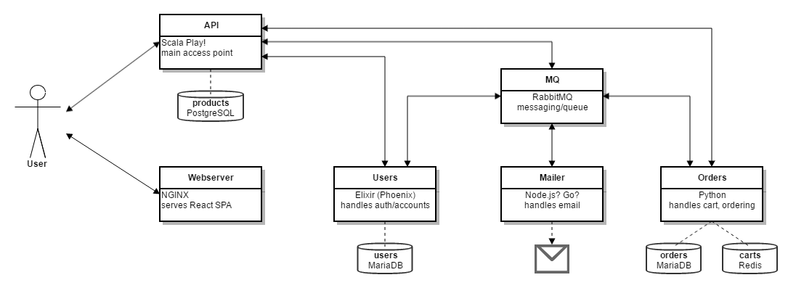

Introduction
============

.. note:: This is an early version and still work in progress!

.. todo::
    * review list

This documentation has been created with the intention of getting developers ready to automatically deploy their apps to the OpenShift container platform. 

We try to achieve this using an exemplary microservice application with basic functionalities of an online shop. Each microservice is continuously integrated and deployed to `APPUiO <https://appuio.ch>`_ (our public OpenShift platform), which allows for an independent description of the necessary pipeline as well as the most relevant concepts for the respective use case.

Before we describe the architecture of our application in more detail, let us shortly summarize what the following chapters include (in order):

.. admonition:: General Concepts
    :class: note

    * Motivation for Docker and OpenShift/APPUiO
    * Motivation for Continuous Integration
    * Overview of CI tooling (Gitlab CI and Jenkins)
    * Overview of Source2Image principles
    * ...

.. admonition:: Webserver
    :class: note

    * Dockerizing a ReactJS application for OpenShift
    * Testing and bundling a ReactJS application
    * Continuous integration with Gitlab CI
    * Deployment strategies for multiple environments
    * Tracking of OpenShift configuration alongside the codebase
    * Optimizing Gitlab CI configurations using variables and templates
    * ...

.. admonition:: API
    :class: note

    * Dockerizing a Scala Play! application
    * Testing and compiling a Scala Play! application
    * Continuous integration with Gitlab CI
    * Using OpenShift Source2Image for building a Docker container
    * Creating a tailor-made Source2Image builder
    * ...

.. admonition:: Users
    :class: note

    * Dockerizing an Elixir application for OpenShift
    * Testing and compiling an Elixir application
    * Building a container using Alpine build and runtime containers
    * Continuous integration with Gitlab CI
    * ...

.. admonition:: Orders
    :class: note

    * Testing a Python application
    * Continuous integration with Jenkins 2 and the OpenShift plugin
    * Creating a tailor-made Jenkins slave (runner)
    * Using the OpenShift Python builder for S2I
    * ...

Architecture of our shop application
------------------------------------

A first clear distinction in our application's architecture can be made between the frontend and the backend of the application. The frontend only contains a single service, which is the **Webserver**. The Webserver is an instance of Nginx that serves some static files (the compiled JS application).

The backend consists of multiple microservices: the main endpoint (**API**) that is accessed from the frontend of the application, a service that handles user management and authentication (**Users**), a service that handles order management (**Orders**) and a service responsible for sending emails (**Mailer**). API, Users and Orders each manage their own database to enforce separation of concerns. The API connects to the other services by using their respective REST endpoints whenever it needs a timely response.

Structure of this documentation
-------------------------------

This documentation is structured such that we first make sure that you know of the most relevant topics and prerequisites for following along later on. The chapter about **General Concepts** provides a short motivation for concepts like Docker and OpenShift and guides you to useful resources if you need to deepen your knowledge about those topics.

The following chapters will each describe one of our services more in depth. We go into how a continuous integration pipeline might be built and how the respective service might be packaged for OpenShift, as well as several more advanced topics. We generally try to account for best practices like the `12-Factor App <https://12factor.net>`_.

Where you can find the sources
------------------------------

.. todo::
    * update the sources

The sources for all the parts of this documentation as well as for all the described examples can be found on `APPUiO GitHub <https://github.com/appuio>`_. The GitHub repositories are synchronized with our internal development repositories and represent the current state. The following lists contain all the public resources and repositories that have been created during the writing of this documentation:

.. admonition:: Documentation
    :class: note

    * `<https://github.com/appuio/docs>`_ in subdirectory *services*

.. admonition:: Microservices
    :class: note

    * **Umbrella repository:** `<https://github.com/appuio/shop-example>`_
    * **API**: `<https://github.com/appuio/shop-example-api>`_
    * **Orders**: `<https://github.com/appuio/shop-example-orders>`_
    * **Users (builder)**: `<https://github.com/appuio/shop-example-users-builder>`_
    * **Users (runtime)**: `<https://github.com/appuio/shop-example-users>`_
    * **Webserver**: `<https://github.com/appuio/shop-example-webserver>`_

.. admonition:: Misc
    :class: note

    * **CI runner for SBT (hub)**: `<https://hub.docker.com/r/appuio/gitlab-runner-sbt>`_
    * **CI runner for SBT (sources)**: `<https://github.com/appuio/gitlab-runner-sbt>`_ 
    * **CI runner for OC (hub)**: `<https://hub.docker.com/r/appuio/gitlab-runner-oc>`_
    * **CI runner for OC (sources)**: `<https://github.com/appuio/gitlab-runner-oc>`_
    * **CI runner for Yarn (hub)**: `<https://hub.docker.com/r/appuio/gitlab-runner-yarn>`_
    * **CI runner for Yarn (sources)**: `<https://github.com/appuio/gitlab-runner-yarn>`_
    * **Vagrant box** with necessary tools: `<https://github.com/appuio/shop-example-vagrant>`_