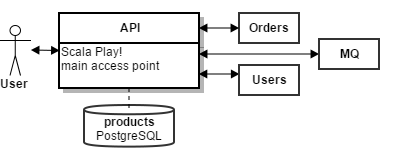

Introduction
============

Having explained the frontend part of our application in the preceding chapter, we will now move on to the microservices that compose the backend part. This chapter is dedicated to the API microservice and will provide an in depth description about its pipeline and principles.

The API microservice consists of a Scala Play! application that exposes a public API and coordinates all the API requests for the application. As the frontend will only ever directly communicate with this service, the complexities of the microservice architecture are effecively hidden.

The API is attached to a database with product data such that it can directly answer simple queries about products (like getting a list of products or details about a single product). More complicated requests like user authentication or ordering of a product are delegated to the corresponding microservice. The other microservices send their response to the Play! application, which will then answer the client's original request.

.. note:: One could (and probably should) extract the handling of product data into its own microservice. This was deliberately left out for the sake of simplicity and time constraints.

Goals for CI
------------

What we would like to achieve with our pipeline can be shortly summarized as follows:

#. Run all of the application's tests
#. Update the application configuration on APPUiO
#. Trigger an S2I build on APPUiO

The following sections will describe how this pipeline might be implemented using **GitLab CI**. Topics that will be covered include (among others):

* Creating a tailor-made source-to-image builder
* Building the application with source-to-image
* Setting up S2I builds on APPUiO
* Applying the practices learned earlier to deploy the service to APPUiO
