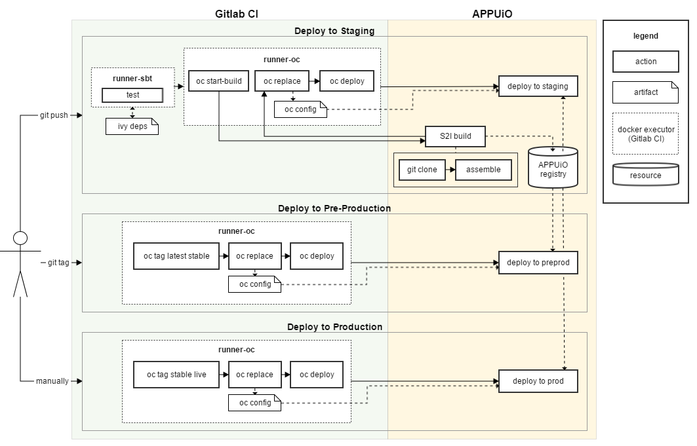

Implementing a CI pipeline
=========================

The CI pipeline for the API service will look a lot like the pipeline we have built for the webserver in the previous chapter. It will differ in specific implementation details (using SBT instead of Yarn etc.) and there won't be any compilation or pushes to the APPUiO registry, which makes the entire pipeline much more compact.

Instead of pushing to the APPUiO registry, the deploy jobs will trigger S2I builds on APPUiO. APPUiO will then grab the sources from our repository and build the service using our custom S2I builder. The necessary steps to setup APPUiO appropriately will be discussed in later sections, the current section will focus on the Gitlab CI side of things.

.. note::

    We will again deploy to three different environments (staging, preprod and prod) but won't go into much detail about this (as deploying to multiple environments has been thoroughly discussed in the previous chapter).

Running tests
-------------

The first step to our CI pipeline will again be running all the tests our application provides. This is a pattern we will adhere to in all of our pipelines (as we have in the webserver chapter). Testing the application as the first step in the pipeline guarantees a quick feedback loop and prevents us from deploying code that could break the application.

The following CI configuration snippet will run tests for our Scala application (including caching and usage of variables): 

.. code-block:: yaml
    :caption: gitlab-ci.yml

    stages:
      - build

    variables:
      SBT_CACHE: ".ivy"
      SBT_VERSION: 0.13.15

    test:
      image: appuio/gitlab-runner-sbt:$SBT_VERSION
      stage: build
      script:
        # test the application with SBT
        - sbt -ivy "$SBT_CACHE" test 
      cache:
        key: "$CI_PROJECT_ID"
        paths:
          - "$SBT_CACHE"

.. admonition:: Relevant Readings/Resources
    :class: note

    #. `Reference Manual [SBT Docs] <http://www.scala-sbt.org/0.13/docs/index.html>`_

Preparing APPUiO for S2I
-----------------------

Our CI pipeline should automatically trigger the S2I builds on APPUiO after all tests have completed successfully. In order to do so, we first need to provide APPUiO with our custom builder.

The custom builder is based on a normal Dockerfile, which means that all we have to do is create a new docker build on APPUiO:

``oc new-build https://github.com/appuio/shop-example-api-builder --name=api-builder``

After this build successfully finishes for the first time, APPUiO will be ready to process our S2I builds using the api-builder image. To create a new deployment config that we can later extend to our needs, we can now simply use the following command:

``oc new-app api-builder~https://github.com/appuio/shop-example-api --name=api-staging``

This will have created a new (default) DeploymentConfig and related objects for our api-staging environment, all of which we will build upon in the coming sections.

.. admonition:: Relevant Readings/Resources
    :class: note

    #. :openshift:`Creating new applications [OpenShift Docs] <dev_guide/application_lifecycle/new_app.html>`

Extending the DeploymentConfig
-----------------------------

The Build- and DeploymentConfigs that OpenShift generated using the ``oc new-build`` and ``oc new-app`` commands are generally quite adequate, but will need to be customized to fit our use case.

Resource quota
^^^^^^^^^^^^^

Using the configuration files that APPUiO has created for us, the builds for this specific service would most certainly fail. This is due to the fact that the JVM of the SBT build tool will need at least 1GB RAM to successfully complete (and is configured to request as much), while an S2I build pod will only get 0.5GB per default.

To get the S2I builds to work successfully, all we have to do is update the resource quota in the **BuildConfig**. This can easily be done by modifying the BuildConfig as follows:

.. code-block:: yaml
    :emphasize-lines: 4, 8-

    apiVersion: v1
    kind: BuildConfig
    metadata:
      name: api-staging
      ...
    spec:
      ...
      resources:
        limits:
          cpu: '1'
          memory: 2Gi
        requests:
          cpu: 500m
          memory: 1Gi

.. note:: Error messages for problems like this are sadly not always informative, which might lead to prolonged debugging. In case of such problems, one might try to simply increase the resource quota and check if the problems persist.

.. admonition:: Relevant Readings/Resources
    :class: note

    #. :openshift:`Compute Resources [OpenShift Docs] <dev_guide/compute_resources.html#dev-compute-resources>`

Incremental builds
^^^^^^^^^^^^^^^^^

To optimize build time for our S2I builds, we will want to use incremental builds (i.e. "caching") wherever possible. OpenShift doesn't perform incremental builds by default, which means we will have to manually update the DeploymentConfig for the api service as follows:

.. code-block:: yaml
    :emphasize-lines: 14

    apiVersion: v1
    kind: BuildConfig
    metadata:
      name: api-staging
      ...
    spec:
      ...
      strategy:
        type: Source
        sourceStrategy:
          from:
            ...
            name: 'api-builder:latest'
          incremental: true
      ...

Deployment to APPUiO
--------------------

There are some other things we want our pipeline to do before it starts a new deployment: it should update configuration objects and it should manage multiple environments. We have seen those principles in the preceding chapter and thus will not describe them in more detail in this section. They will be included in the final Gitlab CI config though. We will also assume that Gitlab CI has already been correctly set up for this service (e.g. the Kubernetes integration).

The following Gitlab CI configuration shows how we could configure the entire pipeline:

.. code-block:: yaml
    :caption: .gitlab-ci.yml
    :linenos:
    :emphasize-lines: 19, 45

    stages:
      - build
      - deploy-staging
      - deploy-preprod
      - deploy-prod

    variables:
      CLUSTER_IP_STAGING: 172.30.216.216
      OC_VERSION: 1.4.1
      SBT_CACHE: ".ivy"
      SBT_VERSION: 0.13.15

    .oc: &oc
      image: appuio/gitlab-runner-oc:$OC_VERSION
      script: &oc_script
        # login to the service account to get access to the CLI
        - oc login $KUBE_URL --token=$KUBE_TOKEN
        # promote the image
        - oc tag api:$BASE_TAG api:$DEPLOY_TAG
        # update the configuration in OpenShift
        - sed -i 's;api-staging;api-'$DEPLOY_ENV';g' docker/openshift/*
        - sed -i 's;api:latest;api:'$DEPLOY_TAG';g' docker/openshift/*
        - sed -i 's;'$CLUSTER_IP_STAGING';'$CLUSTER_IP';g' docker/openshift/*
        - oc replace -f docker/openshift -R
        # trigger a deployment
        - oc rollout latest dc/api-$DEPLOY_ENV

    test:
      ...

    build-staging:
      <<: *oc
      environment: api-staging
      stage: deploy-staging
      script:
        # login to the service account to get access to the CLI
        - oc login $KUBE_URL --token=$KUBE_TOKEN
        # start a new build for staging environment on every push to master
        - oc start-build api --follow
        # update the configuration in openshift
        - oc replace -f docker/openshift -R
        # trigger a deployment
        - oc rollout latest dc/api-staging
      only:
        - master
      except:
        - tags

    build-preprod:
      <<: *oc
      ...

    build-prod:
      <<: *oc
      ...

What is especially important for this configuration is that the S2I build will only every be triggered for the staging environment (as can be seen on line 45). Deployments to preprod or prod environments will simply use a promoted version of the staging image and place different configuration variables in the environment (``oc tag`` on line 19).
