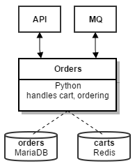

Introduction
============

The **orders** microservice is a `Python/Flask <http://flask.pocoo.org>`_ application that handles processing of orders and stores them to a PostgreSQL database. As it is a backend service, users won't be able to directly connect to it. Instead, every request will pass through the API service, that then relays it to the orders service if appropriate.

For our simple exemplary shop application, placing orders without being logged in does not make much sense. Therefore, the orders microservice will only handle requests from clients that have been previously authenticated by the **users** microservice. This is achieved by validating the signature of the JWT that the client needs to pass with each request and dropping requests without a valid JWT. with an error message.

As Python itself is an interpreted language, we will not have to compile or bundle it as we had to for other services. This will remove quite some complexity from our pipeline.

The orders microservice will be built using a source-to-image strategy. The basic concepts of this strategy have already been explained in *General Concepts* and the *API* microservice chapters. As such, the explanations in this chapter will mainly focus on the parts that differ and cover the remaining parts with less detail.

Goals for CI
------------

What we would like to achieve with our pipeline can be shortly summarized as follows:

#. Spin up a temporary database and run all of the application’s tests
#. Trigger a source-to-image build on APPUiO
#. Update the application configuration on APPUiO
#. Trigger a new deployment in APPUiO

The following sections will describe how this pipeline might be implemented with **Jenkins**. Topics that will be covered include (among others):

* Building a Python application with the S2I builder that OpenShift provides
* Creating a docker image for usage as a Jenkins slave
* Using said image for running Jenkins pipelines
* Triggering S2I builds from Jenkins using the OpenShift integration
* Applying the practices learned in the earlier chapters to deploy the service to APPUiO