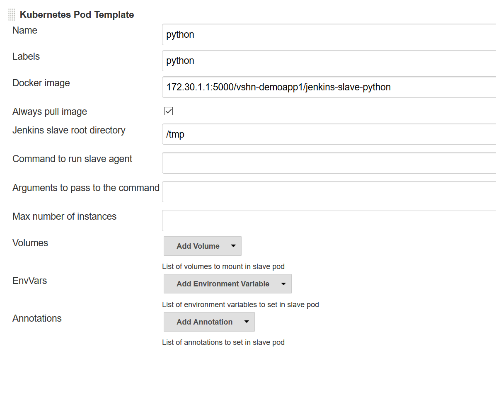

Integrating Jenkins with APPUiO
===============================

Recent developments on the OpenShift platform have introduced a growing number of possibilities for integration with the Jenkins CI/CD platform. An instance of Jenkins that runs on OpenShift can now easily access deployments and builds.

For example, triggering a new build on OpenShift can be done with a simple command without any complicated login procedures. Also, the status of Jenkins pipelines can be displayed directly inside the OpenShift web interface (when deployments are appropriately configured).

However, even though Jenkins on OpenShift offers easy integration, there are some caveats when running jobs. To achieve the same kind of flexibility we had in Gitlab CI (using custom runners etc.), we need to build so called Jenkins "slaves". These slaves are docker images that are based on the official slave base image (`jenkins-slave-base-centos7 <https://hub.docker.com/r/openshift/jenkins-slave-base-centos7>`_) and extend it by the packages and dependencies that will be needed within the jobs.

Once prepared and configured, the slave images are started as pods when a new job starts and are removed after a defined time or after the job finishes. For the orders service, this slave image will only need to contain Python, as dependencies will be installed within the job. This section will be dedicated to explaining how slave images can be created and how Jenkins has to be configured such that it makes use of these slave images.

Creating a slave image
----------------------

Jenkins slave images are generally nothing more than normal docker images that base on the Jenkins slave base. The Jenkins slave base contains all binaries that Jenkins needs to run its jobs inside the slave. This means that the only thing we have to add is the dependencied **we** are going to use during the jobs.

For the *orders* microservice, the only thing that needs to be installed is a current version of Python. The Dockerfile used for our service looks as follows:

.. code-block:: docker
    :caption: Dockerfile
    :linenos:
    :emphasize-lines: 1-2, 4-5, 24-25

    # extend the official jenkins slave base image
    FROM openshift/jenkins-slave-base-centos7

    # specify wanted version of python
    ENV PYTHON_VERSION 3.6.1

    # install python
    RUN set -x \
        && chown -R root:root /home/jenkins \
        && INSTALL_PKGS="gcc make openssl-devel wget zlib-devel" \
        && yum install -y --setopt=tsflags=nodocs $INSTALL_PKGS \
        && cd /tmp \
        && wget https://www.python.org/ftp/python/${PYTHON_VERSION}/Python-${PYTHON_VERSION}.tgz \
        && tar xf Python-${PYTHON_VERSION}.tgz \
        && cd Python-${PYTHON_VERSION} \
        && ./configure \
        && make altinstall \
        && cd .. \
        && rm -rf Python-${Python_VERSION} \
        && yum remove -y $INSTALL_PKGS \
        && yum clean all \
        && chown 1001:0 /home/jenkins

    # switch to non-root for openshift usage
    USER 1001

As this slave image will be started inside an OpenShift pod, we again have to adhere to the OpenShift guidelines. This means that we cannot run the image as root and therefore need to configure the image such that it runs as a non-root (numerical) user (lines 22, 24-25).

We chose to manually install Jenkins from the sources, as this allows us to get bleeding-edge versions of Python (in case we need them). The slave image could potentially be extended with a tool like virtualenv such that multiple versions of Python are available (e.g. if an application should be tested against Python 3.5 as well as Python 3.6).

.. admonition:: Relevant Readings/Resources
    :class: note

    #. `jenkins-slave-base-centos7 [Docker Hub] <https://hub.docker.com/r/openshift/jenkins-slave-base-centos7>`_
    #. `slave-base [GitHub] <https://github.com/openshift/jenkins/tree/master/slave-base>`_
    #. `jenkins-slave-python [GitHub] <https://github.com/appuio/jenkins-slave-python>`_

Building the slave image
------------------------

Now that we have created the slave image we will use later on, we need to build it on APPUiO such that Jenkins can then pull it from the APPUiO registry. This can be achieved by configuring a build based on the docker strategy.

.. code-block:: bash

    $ oc new-build https://github.com/appuio/jenkins-slave-python
    --> Found Docker image ...from Docker Hub for "openshift/jenkins-slave-base-centos7"

        * An image stream will be created as "jenkins-slave-base-centos7:latest" that will track the source image
        * A Docker build using source code from https://github.com/appuio/jenkins-slave-python will be created
          * The resulting image will be pushed to image stream "jenkins-slave-python:latest"
          * Every time "jenkins-slave-base-centos7:latest" changes a new build will be triggered

    --> Creating resources with label build=jenkins-slave-python ...
        imagestream "jenkins-slave-base-centos7" created
        imagestream "jenkins-slave-python" created
        buildconfig "jenkins-slave-python" created
    --> Success
        Build configuration "jenkins-slave-python" created and build triggered.
        Run 'oc logs -f bc/jenkins-slave-python' to stream the build progress.

OpenShift is able to intelligently detect that it has to use a docker build (as the repository contains a Dockerfile). After the command finishes successfully, ImageStreams as well as a BuildConfig will have been created and a build should already be in progress.

Adding a pod template for the slave image
-----------------------------------------

.. note:: We assume that Jenkins 2 has been installed using the official Jenkins template in the OpenShift catalog.

The next step after creating the build is logging in to Jenkins and configuring a new Kubernetes pod template. This template will include a reference to our slave image in the APPUiO registry and will allow Jenkins to spawn new pods based on said image.

Kubernetes pod templates can be managed in the Jenkins system configuration (*Manage Jenkins > Configure System*). Once there, scroll down until you reach the *Cloud/Kubernetes* section of the page. When using the official Jenkins template, APPUiO should already be preconfigured in this section (along with some pod templates).

All we have to do in the system configuration is add a new pod template for our Python slave. To configure the pod template appropriately, use settings as can be seen below:

The pod template mostly corresponds to the preset templates for maven and node. The only differences are that we link to our slave image in the internal APPUiO registry and that we set it up such that the image is pulled every time before starting up a pod.

Configuring credentials
-----------------------

Besides configuring a pod template, we need to provide Jenkins with an OpenShift token such that it might log in to the CLI. We have to do this because we will need advanced functionality (like ``oc replace``) and thus will be using the *openshift-client-plugin* (which allows us to use any CLI command in our pipelines).

When using the official Jenkins 2 template to install Jenkins, OpenShift automatically creates a serviceaccount for usage with Jenkins. To allow the *openshift-client-plugin* to connect to OpenShift via the CLI, we nneed to provide it with the token for this serviceaccount.

To find the token, use the following commands:

.. code-block:: bash
    :linenos:
    :emphasize-lines: 12-13

    $ oc describe sa jenkins
    Name:           jenkins
    Namespace:      vshn-demoapp1
    Labels:         app=jenkins-persistent
                    template=jenkins-persistent-template

    Image pull secrets:     jenkins-dockercfg-3uy3r

    Mountable secrets:      jenkins-token-tbo11
                            jenkins-dockercfg-3uy3r

    Tokens:                 jenkins-token-qb9m8
                            jenkins-token-tbo11

.. code-block:: bash
    :linenos:
    :emphasize-lines: 10

    $ oc describe secret jenkins-token-tbo11
    Name:           jenkins-token-tbo11

    ...

    Type:   kubernetes.io/service-account-token

    Data
    ====
    token:          eyJh ...
    ca.crt:         1066 bytes
    namespace:      13 bytes
    service-ca.crt: 2235 bytes

The token visible on line 10 then needs to be specified as a new global credential in the Jenkins interface. To do this, go to *Credentials > System > Global credentials*. You should see a list of global credentials. A credential for a *Kubernetes Service Account* might already exist, however, we will need to add an *OpenShift Token* credential.

Go to *Add credentials* in the lefthand menu and choose *OpenShift Token* from the dropdown menu. Paste the token we found above into the appropriate field and specify a unique ID that you will use to refer to this token in the pipelines.

Once you have successfully added this token, Jenkins is appropriately configured to handle our pipelines. The next chapter will describe in detail how these pipelines can be built.

.. admonition:: Relevant Readings/Resources
    :class: note

    #. `Jenkins Client Plugin [GitHub] <https://github.com/openshift/jenkins-client-plugin>`_
