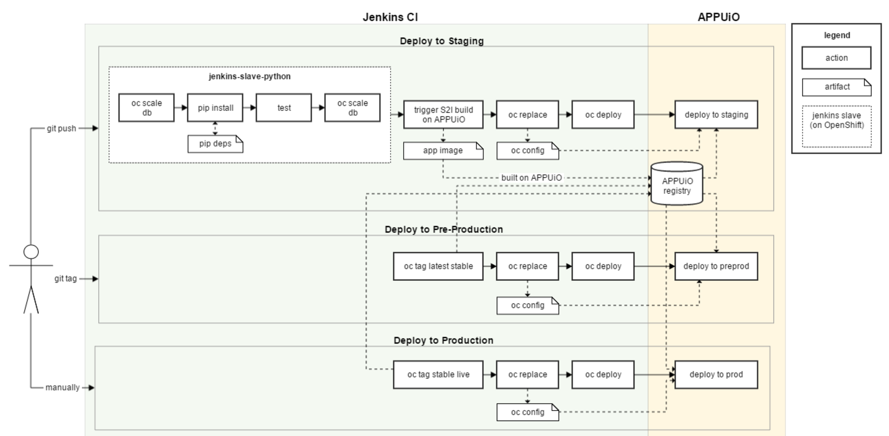

Implementing a CI Pipeline
==========================

.. note:: This is an early version and still work in progress!

.. todo::
    * pipeline intro
    * describe how to start a new s2i build from jenkins
    * link to more specific information about jenkins configs

Scripted vs. Declarative Pipeline
--------------------------------

Similar to the way Gitlab CI defines its pipeline in a ``gitlab-ci.yml`` file, a Jenkins pipeline is defined in a so called ``Jenkinsfile``. There are two different ways of structuring a Jenkinsfile: as a **Scripted Pipeline** or as a **Declarative Pipeline**. 

A scripted pipeline is basically *Groovy* code that can use Jenkins specific commands and is then serially executed to run the pipeline. Scripted pipelines are very flexible in that they are basically only restricted by the capabilities of the Groovy language. However, this means that one needs to be able to code Groovy to create a more complex pipeline.

The declarative pipeline syntax has been introduced only recently to provide a syntax that can be read and written by people without the necessity to know Groovy. Many parts of its structure are predefined, which makes it less flexible but more expressive. Additionally, its more opinionated syntax already enforces some best practices. There are ways to use snippets of scripted pipeline inside a declarative pipeline, such that some of the benefits of both can be combined.

As Gitlab CI uses a YAML syntax which in itself is also declarative, we will structure the Jenkinsfile for the orders service as a declarative pipeline. However, there will be some snippets of scripted pipeline included, as the restrictions of the declarative pipeline would not allow some of our specific use cases.

.. admonition:: Relevant Readings/Resources
    :class: note

    #. `Syntax Comparison [Jenkins Docs] <https://jenkins.io/doc/book/pipeline/syntax/#compare>`_

Basic structure of a declarative pipeline
----------------------------------------

To explain the concepts we applied while building the pipeline for this service, we will build up step by step from the very simple pipeline that can be seen below:

.. code-block:: groovy
    :caption: Jenkinsfile
    :linenos:
    :emphasize-lines: 2-6, 9-14

    pipeline {
      agent {
        // run with the custom python slave
        // will dynamically provision a new pod on APPUiO
        label 'python'
      }

      stages {
        stage('test') {
          // TODO
          steps {
            echo 'hello world'
          }
        }

        stage('deploy-staging') {
          steps {
            // TODO
          }
        }

        stage('deploy-preprod') {
          steps {
            // TODO
          }
        }

        stage('deploy-prod') {
          steps {
            // TODO
          }
        }
      }
    }

This (working) pipeline shows the basic conventions that we need to use while building up our pipeline. The entire pipeline needs to be wrapped in a ``pipeline`` block. This block contains a list of named ``stages``, which are defined using the ``stage(name)`` function. A ``steps`` block inside each stage then contains the commands that will be executed in that particular stage.

The ``agent`` block on lines 2-6 specifies the executor that our pipeline should use for the stages. In our case, we want Jenkins to use our custom Jenkins slave, which is why we define ``label 'python'``. We defined this label when configuring the Jenkins pod template in the previous chapter. One thing to note is that the agent directive can be specified on a pipeline level as seen above and/or on a stage level (which you will see later on).

.. admonition:: Relevant Readings/Resources
    :class: note

    #. `Pipeline Syntax [Jenkins Docs] <https://jenkins.io/doc/book/pipeline/syntax>`_
    #. `Pipeline Examples [Github] <https://github.com/jenkinsci/pipeline-examples>`_
    #. `Pipeline Best Practices [Github] <https://github.com/jenkinsci/pipeline-examples/blob/master/docs/BEST_PRACTICES.md>`_

Implementing the test step
-------------------------

As usual, the first thing we want to do in our pipeline will be testing the application. The tests for the orders application depend on the existence of a database, which means that Jenkins will need to dynamically spin up a database on APPUiO each time the pipeline is run.

The way we implemented this for the orders service can be shortly summarized as follows:

    #. Create a DeploymentConfig for an ephemeral instance of postgres
    #. Set the number of replicas for this instance to zero
    #. On each run of the Jenkins pipeline:
        #. Scale the deployment to one replica
        #. Install pip packages that are needed for testing
        #. Perform the tests
        #. Scale the deployment to zero replicas (even if tests fail!)

.. note:: As the database is ephemeral, no data will be persisted and therefore each round of testing will be based on an empty database. Other implementations might need to reset/purge the database before each round of testing.

Creating an ephemeral database
^^^^^^^^^^^^^^^^^^^^^^^^^^^^^

To create an ephemeral instance of PostgreSQL, we can use the ``postgresql-ephemeral`` template from the OpenShift catalog. The following command will instantiate the template using the CLI:

.. code-block:: bash

    $ oc new-app postgresql-ephemeral -p DATABASE_SERVICE_NAME=orders-test,POSTGRESQL_USER=orders,POSTGRESQL_PASSWORD=secret,POSTGRESQL_DATABASE=orders --name orders-test
    --> Deploying template "postgresql-ephemeral" in project "openshift"

        PostgreSQL (Ephemeral)
        ---------

        ...

    --> Creating resources with label app=postgresql-ephemeral ...
        secret "orders-test" created
        service "orders-test" created
        deploymentconfig "orders-test" created
    --> Success
        Run 'oc status' to view your app.

After creating the database as described above, scale it to zero replicas:

.. code-block:: bash

    $ oc scale --replicas=0 dc orders-test
    deploymentconfig "orders-test" scaled

Scaling the database in CI
^^^^^^^^^^^^^^^^^^^^^^^^^

APPUiO should now be ready support our test steps in Jenkins. Before and after actually running the tests, we will need to scale the database to an appropriate amount of replicas. This can easily be done with the OpenShift Jenkins plugin.

To implement this behavior, we extend the Jenkinsfile as follows:

.. code-block:: groovy
    :caption: Jenkinsfile
    :linenos:
    :emphasize-lines: 14, 17, 24-30

    pipeline {
      agent any
    
      stages {
        stage('test') {
          agent {
            // run with the custom python slave
            // will dynamically provision a new pod on APPUiO
            label 'python'
          }

          steps {
            // scale the ephemeral orders-test database to 1 replica
            openshiftScale(depCfg: 'orders-test', replicaCount: '1')

            // sleep for 20s to give the db chance to initialize
            sleep 20

            // TODO: install dependencies

            // TODO: run tests
          }

          post {
            always {
                // scale the ephemeral orders-test database to 0 replicas
                // as it is ephemeral, all data will be lost
                openshiftScale(depCfg: 'orders-test', replicaCount: '0')
            }
          }
        }

        ...

      }
    }

As can be seen in the snippet, scaling a DeploymentConfig is as simple as using the ``openshiftScale()`` step with appropriate parameters (lines 14, 28). After scaling up the database, we need to add an additional 20 seconds of sleep time to give the database time to initialize (line 17).

As we want to scale down the database in any case (even if the pipeline fails), we need to put the command into the ``post`` section of the stage and inside an ``always`` block. The ``post`` section will be executed after a pipeline finishes, independent of its status. Next to ``always``, there are many other blocks that for example only get executed on failures (to send an email etc.).

.. admonition:: Relevant Readings/Resources
    :class: note

    #. `OpenShift Jenkins Plugin [Github] <https://github.com/openshift/jenkins-plugin>`_

Running tests in CI
^^^^^^^^^^^^^^^^^^^

.. todo::
    * Find an approach for caching dependencies

To actually run the tests in the pipeline, we need to install the Python (pip) dependencies and execute the test script. We also need to add environment variables that contain the database credentials, as the test script will be expecting these.

We end up with a complete version of the test stage after adding the steps for testing:

.. code-block:: groovy
    :caption: Jenkinsfile
    :linenos:
    :emphasize-lines: 4-9, 27, 30

    pipeline {
      agent any

      environment {
        DB_HOSTNAME = 'orders-test'
        DB_USERNAME = 'orders'
        DB_PASSWORD = 'secret'
        DB_DATABASE = 'orders'
      }

      stages {
        stage('test') {
          agent {
            // run with the custom python slave
            // will dynamically provision a new pod on APPUiO
            label 'python'
          }

          steps {
            // scale the ephemeral orders-test database to 1 replica
            openshiftScale(depCfg: 'orders-test', replicaCount: '1')

            // sleep for 20s to give the db chance to initialize
            sleep 20

            // install the application requirements
            sh 'pip3.6 install --user -r requirements.txt'

            // run the application tests with verbose output
            sh 'python3.6 -m unittest wsgi_test --verbose'
          }

          post {
            always {
              // scale the ephemeral orders-test database to 0 replicas
              // as it is ephemeral, all data will be lost
              openshiftScale(depCfg: 'orders-test', replicaCount: '0')
            }
          }
        }

        ...

      }
    }

The environment variables we specified inside the ``environment`` block (lines 4-9) are available in the environment of our Jenkins slave, where the Python test script can pick them up and connect to the database. Installing the dependencies and running said test script is as easy as adding two bash commands using the ``sh`` step (lines 27, 30).

Implementing the deployment step
-------------------------------

The pipeline we have built so far will successfully test the application. After these tests successfully finish, we would like the pipeline to start and track a Source-To-Image build and deploy the newly created image (alongside its configuration). This section will explain our approach for implementing this and cover some of the differences in capabilities between Jenkins and Gitlab CI.

.. todo::
    * Find an approach for deployment to multiple environments using git tags and manual intervention

Deployment to multiple environments
----------------------------------
