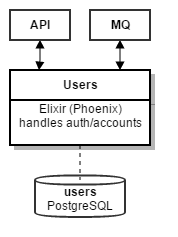

Introduction
============

The **users** microservice is an `Elixir <http://elixir-lang.org>`_/`Phoenix <http://www.phoenixframework.org/>`_ application that manages user authentication. It runs as a backend service and is only accessible through the **API** as can be seen above.

Authentication principles
-------------------------

In the event of a user submitting the registration/login form on the frontend, the API will receive the request and proxy it to the corresponding endpoint of the users service. The service will perform the applicable steps and return a response to the API, which will proxy it to the user.

On a successful login, the user will receive a so called `JSON Web Token (JWT) <https://jwt.io>`_. This is a cryptographically signed piece of information which can be used for authentication and storing some user data. The application frontend will append this token to all subsequent requests, which will allow the user to perform restricted actions (like ordering the contents of his cart).

The main advantage of said tokens is that they are signed with a secret key (only known to "us"), which means that we can verify the contents of the token and ensure that they have not been tampered with. We will use this to our advantage and include the `UUID <https://en.wikipedia.org/wiki/Universally_unique_identifier>`_ of each user in their respective token.

Concerning our microservice example, this allows us to perform actions in other services while being certain that the user sending the request has been properly authenticated (as the token can only have been signed by the users microservice, which will only do so after a successful login). For example, the **orders** microservice may process an order for a user (based on his *UUID*) without having to be concerned about authentication.

Goals for CI
------------

What we would like to achieve with our pipeline can be shortly summarized as follows:

#. Run all of the application’s tests
#. Create a new release from the application sources
#. Build a docker container that can be run on APPUiO
#. Push the newly built container directly to the APPUiO registry
#. Update the application configuration on APPUiO
#. Trigger a new deployment in APPUiO

The following sections will describe how this pipeline might be implemented with **Gitlab CI**. Topics that will be covered include (among others):

* Creating a **builder** image based on Alpine
* Building the application sources with said image
* Creating a **runtime** image based on Alpine
* Applying the practices learned in the earlier chapters to deploy the service to APPUiO
