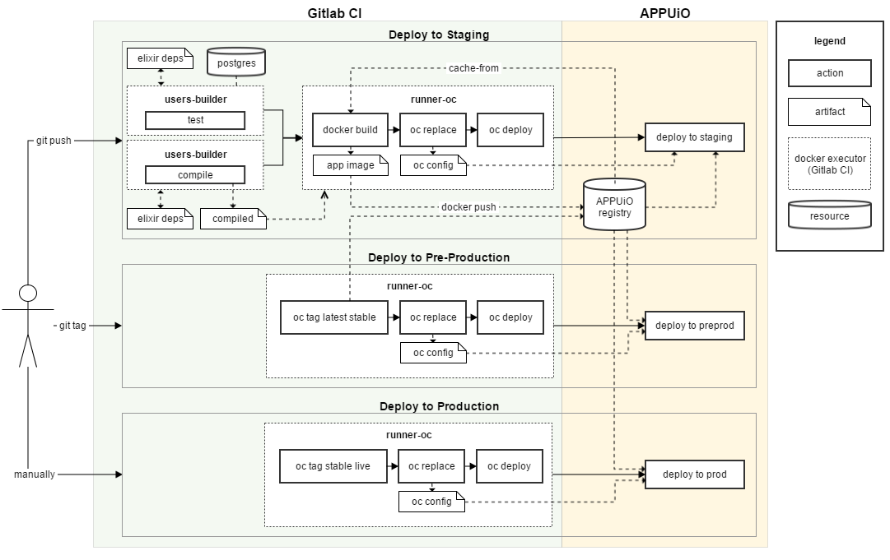

Implementing a CI Pipeline
==========================

.. note:: This is an early version and still work in progress!

.. todo::
    * describe compile step with builder image
    * describe creation of runtime image

After having read the previous chapters (where we already described how to build two CI pipelines in Gitlab CI), you should be quite familiar with the way Gitlab CI works. This chapter will describe how we have built a CI pipeline using a builder image for the test and compilation step and a runtime image for the runtime build (the basic intuition for this has been explained in the last chapter). The deploy step of the CI pipeline will push the built runtime image to the internal APPUiO registry, update the deployment configurations and finally start a new deployment for the service.

Running tests
------------

Testing our Elixir application in Gitlab CI involves the same basic steps that we have already seen when testing it with docker-compose (starting up a database and running tests against it). Gitlab CI (with docker executors) has a nice feature using which we can spin up one or several arbitrary docker containers and attach them to the main runner. These services can be specified on a job level which makes the whole process very flexible.

Gitlab CI calls those temporary dependencies *services*. To configure our test step such that it uses a PostgreSQL service, we can define a job as follows:

.. code-block:: yaml
    :linenos:
    :caption: .gitlab-ci.yaml
    :emphasize-lines: 17-19, 27-29

    stages:
      - build

    variables:
      MIX_DEPS: deps

    .builder: &builder
      stage: build
      image: appuio/shop-example-users-builder:latest
      cache:
        key: $CI_PROJECT_ID
        paths:
        - $MIX_DEPS

    test:
      <<: *builder
      services:
        # spin up a temporary database for testing
        - postgres:9.5
      script:
      # install necessary application packages
        - mix deps.get
        # compile the application
        - mix compile
        # run tests
        - mix test --trace test/integration/*
      variables:
        POSTGRES_USER: users
        POSTGRES_PASSWORD: secret
        DB_HOSTNAME: postgres
        DB_USERNAME: users
        DB_PASSWORD: secret
        DB_DATABASE: users
        MIX_ENV: test

The PostgreSQL database we configured as a service on line 18 is made available to the runner on the hostname ``postgres``. Gitlab CI injects all the variables defined for the job into the service container, which means that we can configure the postgres service by specifying ``POSTGRES_USER`` and ``POSTGRES_PASSWORD`` as variables (as we usually would for a postgres container).

When calling ``mix test``, the application will then be tested against the database that we specified using the ``DB_*`` environment variables.

.. admonition:: Relevant Readings/Resources
    :class: note

    #. `Services [Gitlab Docs] <https://docs.gitlab.com/ce/ci/services>`_
    #. `Postgre example [Gitlab Docs] <https://docs.gitlab.com/ce/ci/services/postgres.html>`_

Compiling the application
------------------------

Besides running our tests using the users-builder, we will also need to compile our Elixir sources and build a deployable release. As we have seen in the last chapter, we can do this using the ``mix release`` command.

It is recommended to build pipelines that *fail fast*. This means that they should break as early as possible such that one doesn't have to wait until the last step to find out that the application didn't even compile. To make our pipeline fail as fast as possible, we will run the compile step in parallel with the test step, only building the docker container once both test and compile have finished successfully.

.. code-block:: yaml
    :caption: .gitlab-ci.yml
    :linenos:
    :emphasize-lines: 17-

    stages:
      - build

    variables: ...

    .builder: ...

    test: ...

    compile:
      <<: *builder
      script:
        # install necessary application packages
        - mix deps.get
        # build the application sources
        - MIX_ENV=prod mix release
      artifacts:
        expire_in: 5min
        paths:
          - _build
      only:
        - master
        - tags

As we can see, this job is simpler than the test job in that it doesn't depend on any external services. To ensure that the release built by ``mix release`` is injected into the following docker build job, we need to add an artifacts declaration (as on lines 20-23). Additionally, while we want every commit on every branch to be tested, the compile step should only be run when one commits to the master branch or tags a new release (as on lines 24-26).

Building a container
-------------------

After testing and compilation have successfully finished, Gitlab CI should build a docker container and push it to the APPUiO registry. This works exactly the same as in the other services we have already built with Gitlab CI.

.. code-block:: yaml
    :caption: .gitlab-ci.yml
    :linenos:

    

