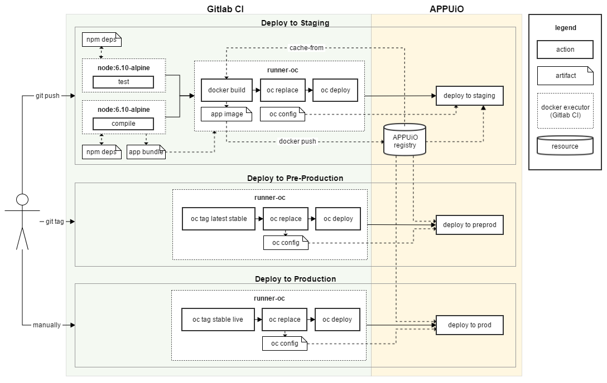

Introduction
============

As we specified early on, we would like our pipeline to:

#. Run all of the application's tests
#. Build an optimized JavaScript bundle that can be served statically
#. Build a docker container that can be run on APPUiO
#. Push the newly built container directly to the APPUiO registry
#. Update the application configuration on APPUiO
#. Trigger a new deployment in APPUiO

What we didn't explain earlier is that there will be multiple environments where deployments can happen:

#. **Staging**: Deploy here after every push to or merge into the master branch. This environment will be used for early testing.
#. **Pre-prod**: Deploy here after a new release has been tagged. Final testing will be done on this environment.
#. **Prod**: Deploy here only after the deployment on pre-prod has been thoroughly tested and accepted. This deployment has to be triggered manually. It will reuse the docker image that has been built for the pre-prod environment.

We will specify different docker image tags for each environment to implement this strategy in APPUiO. The staging environment will be configured such that it runs images with a tag of *latest*. The same principle holds for images tagged as *stable* (pre-prod) and images tagged as *live* (prod). The deployment strategy will be explained in detail later on.

The first and next step towards implementing our Gitlab CI pipeline is automating the tasks we ran manually. We will start with the first task (testing) in the following section.

Running tests
-------------

The first step we would like to automate is testing the application. The simplest automation of what we did by running ``yarn install`` and ``yarn test`` would be the following Gitlab CI YAML:

.. code-block:: yaml
    :caption: .gitlab-ci.yml
    :linenos:
    :emphasize-lines: 5, 7

    test:
      image: node:6.10-alpine
      script:
        # install necessary application packages
        - yarn install
        # test the application sources
        - yarn test

This simple job will tell Gitlab CI that it should pull the official NodeJS docker image from the Hub and run the specified Yarn commands inside a NodeJS container. The NodeJS image already includes Yarn as a binary, which is very convenient for us (NodeJS 6.10 and later).

This would work on its own, although it has one severe flaw: as the images are run in a newly created container every time, each run of ``yarn install`` has to download all the application's dependencies. This will slow down the entire job.

.. admonition:: Relevant Readings / Resources
    :class: note

    #. `Using Docker Images [Gitlab Docs] <https://docs.gitlab.com/ce/ci/docker/using_docker_images.html#using-docker-images>`_
