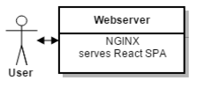
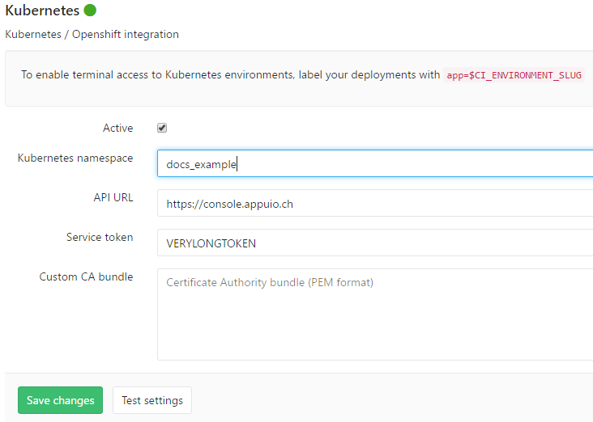

Webserver
=========

The first part of our microservice architecture that will be explained is the **webserver**. It is the first service the user connects to and one of only two services that are exposed to the user. The webserver consists of an instance of `nginx <https://www.nginx.com>`_ (a high-performance webserver) serving the application's frontend (static files like HTML, CSS, JS and images).

The frontend has been designed as a Single-Page-App (SPA) which runs computations in the client's browser and only connects to the API if it needs to fetch data. This is a frequently used pattern in modern web applications as API's often also need to be accessible using native apps and other means. The basic technologies used are `React <https://facebook.github.io/react>`_ (a JavaScript framework), `Webpack <https://webpack.js.org>`_ (a JavaScript bundler) and `Yarn <https://yarnpkg.com>`_ (package management). We won't go into the implementation details, but you are welcome to have a look at the source of the application in the ``docs_webserver`` repository.

The webserver lends itself to some introductory explanations about continuous integration pipelines and docker deployments to APPUiO (building on those in the **General Concepts** section), as the build/deployment pipeline is quite simple and as it doesn't directly depend on any other service. 

What we would like to achieve with our pipeline can be shortly summarized as follows:

#. Run all of the application's tests
#. Build an optimized JavaScript bundle that can be served statically
#. Build a docker container that can be run on APPUiO
#. Push the newly built container directly to the APPUiO registry
#. Trigger a new deployment in APPUiO

The following sections will describe how this pipeline might be implemented using **Gitlab CI**. Topics that will be covered include:

* Building and running the service as a docker container
* Implementing a simple Gitlab CI pipeline with caching and artifacts
* Strategies when using multiple deployment environments (staging, prod etc.)
* Preparing our APPUiO project such that we can deploy the service (routes, deployments etc.)
* Extending our pipeline such that the APPUiO configuration is tracked alongside our source code
* Adding health checks to the deployment of our service
* ...

Building a container
--------------------

The first thing we need to achieve such that we can later deploy our application to APPUiO is packaging it into a docker container. The Dockerfile for this is quite simple: 

.. literalinclude:: source/Dockerfile
    :language: docker
    :caption: docs_webserver/Dockerfile
    :name: docs_webserver/Dockerfile
    :linenos:
    :emphasize-lines: 6, 12, 18

Most commands should be understandable by their respective comments (for a reference see #1).

There is one very important concept we would like to emphasize: OpenShift enforces that the main process inside a container must be executed by an unnamed user with numerical id (see #2). This is due to security concerns about the permissions of the root user inside a container as it might break out and access the host. If the webserver is ultimately deployed to OpenShift, the platform will assign a random numerical id in place of the defined id 1001.

Due to these security restrictions, the official nginx image has to be configured differently, as it normally wants to run as root (which would cause the deployment on OpenShift to fail). We need to use a customized nfinx configuration such that the process doesn't get killed by OpenShift. Said configuration is copied into the container on line 12 of the above Dockerfile (see #3 and #4).

The most important customizations needed in order to run nginx on APPUiO are shown in the source extract below:

.. literalinclude:: source/docker/nginx.conf
    :language: nginx
    :caption: docs_webserver/docker/nginx.conf
    :name: docs_webserver/docker/nginx.conf
    :linenos:
    :lines: 7-16, 37-
    :emphasize-lines: 5, 8, 12, 15-19, 24-26

The next section will show how we can build the application sources and run the application as a docker container (using the provided Vagrant box).

**Relevant Readings / Resources**

#. `Dockerfile reference [Docker Docs] <https://docs.docker.com/engine/reference/builder>`_
#. `Supporting Arbitrary User IDs [OpenShift Docs] <https://docs.openshift.com/container-platform/latest/creating_images/guidelines.html#openshift-container-platform-specific-guidelines>`_
#. `Running nginx as a non-root user [ExRatione] <https://www.exratione.com/2014/03/running-nginx-as-a-non-root-user>`_
#. `Livingdocs nginx.conf [GitHub] <https://github.com/upfrontIO/livingdocs-docker/blob/master/editor/docker/nginx.conf>`_

Running the container
---------------------

In order to run our app, we will need to build the JavaScript sources with Webpack and then inject the bundle into a docker container (using docker build). The easiest way to try this without having to install all the necessary dependencies is to use our provided Vagrant box. 

After starting the box and connecting with ``vagrant ssh``, we can run the following commands:

**Testing the application**: ``yarn install`` and ``yarn test``

**Building the sources**: ``yarn run build`` (after ``yarn install``)

**Building a container**: ``docker build . -t docs_webserver:latest``

**Running the container**: ``docker run -it docs_webserver:latest --name webserver``

You should now have a working frontend which you can reach using ``VAGRANT_VM_IP:9000``.

In the next section, we will implement all of those steps as an automated pipeline using Gitlab CI.

Implementing a CI Pipeline
--------------------------

.. image:: webserver_pipeline.PNG

As we specified early on, we would like our pipeline to:

#. Run all of the application's tests
#. Build an optimized JavaScript bundle that can be served statically
#. Build a docker container that can be run on APPUiO
#. Push the newly built container directly to the APPUiO registry
#. Trigger a new deployment in APPUiO

What we didn't explain earlier is that there will be multiple environments where deployments can happen:

#. **Staging**: Deploy here after every push to or merge into the master branch. This environment will be used for early testing.
#. **Pre-prod**: Deploy here after a new release has been tagged. Final testing will be done on this environment.
#. **Prod**: Deploy here only after the deployment on pre-prod has been thoroughly tested and accepted. This deployment has to be triggered manually. It will reuse the docker image that has been built for the pre-prod environment.

We will specify different docker image tags for each environment to implement this strategy in APPUiO. The staging environment will be configured such that it runs images with a tag of *latest*. The same principle holds for images tagged as *stable* (pre-prod) and images tagged as *live* (prod). The deployment strategy will be explained in detail later on.

The first and next step towards implementing our Gitlab CI pipeline is automating the tasks we ran manually. We will start with the first task (testing) in the following section.

Running tests
^^^^^^^^^^^^^

The first step we would like to automate is testing the application. The simplest automation of what we did by running ``yarn install`` and ``yarn test`` would be the following Gitlab CI YAML:

.. code-block:: yaml
    :caption: .gitlab-ci.yml
    :linenos:
    :emphasize-lines: 5, 7

    test:
      image: node:6.10-alpine
      script:
        # install necessary application packages
        - yarn install
        # test the application sources
        - yarn test

This simple job will tell Gitlab CI that it should pull the official NodeJS docker image from the Hub and run the specified Yarn commands inside a NodeJS container. The NodeJS image already includes Yarn as a binary, which is very convenient for us (NodeJS 6.10 and later).

This would work on its own, although it has one severe flaw: as the images are run in a newly created container every time, each run of ``yarn install`` has to download all the application's dependencies. This will slow down the entire job.

Using caching
"""""""""""""

The solution to this is called **caching** (in Gitlab CI as well as in other CI tools). Gitlab CI allows us to store (*cache*) directories inside the project's scope after a job has finished and restore them to the same location before any subsequent run of the same job. This can be used to cache the downloaded NPM packages and restore them such that they don't have to be downloaded every time.

To get this to work with Yarn and some other build tools, they have to be configured appropriately. Yarn would normally cache packages in the user's home directory, such that the cache can also be used in any other project the user might have. However, Gitlab CI doesn't allow us to cache directories outside of a project's scope. This means that we have to specify a directory in scope where Yarn can store its cache. 

We can achieve this by using the ``--cache-folder=`` flag on our ``yarn install`` command. Yarn will store its cache in the specified directory and recognize those cached packages on ``yarn install`` in subsequent runs. It will only download updates for outdated packages.

The following snippet shows how we could update the configuration to introduce caching with Yarn:

.. code-block:: yaml
    :caption: .gitlab-ci.yml
    :linenos:
    :emphasize-lines: 5, 8-

    test:
      image: node:6.10-alpine
      script:
        # install necessary application packages
        - yarn install --cache-folder=".yarn"
        # test the application sources
        - yarn test
      cache:
        key: "$CI_PROJECT_ID"
        paths:
          - .yarn
          - node_modules

This configuration will tell Gitlab CI that it should cache the files inside the *.yarn* and *node_modules* directories between subsequent runs. Also, setting *key* to a constant value allows us to use the same cache no matter what branch we are on.

**Relevant Readings / Resources**

#. `Using Docker Images [Gitlab Docs] <https://docs.gitlab.com/ce/ci/docker/using_docker_images.html#using-docker-images>`_
#. `Caching [Gitlab Docs] <https://docs.gitlab.com/ce/ci/yaml/#cache>`_

Building the sources
^^^^^^^^^^^^^^^^^^^^

The next step would be that Gitlab CI bundles our application sources using Webpack such that they can later be injected into a docker image.

A simple implementation of this job could look as follows:

.. code-block:: yaml
    :caption: .gitlab-ci.yml
    :linenos:
    :emphasize-lines: 5, 7

    compile:
      image: node:6.10-alpine
      script:
        # install necessary application packages
        - yarn install --cache-folder=".yarn"
        # build the application sources
        - yarn build
      cache:
        key: "$CI_PROJECT_ID"
        paths:
          - .yarn
          - node_modules

This job would successfully build our application and store a bundle in a directory called *build*. However, Gitlab CI doesn't store anything in between jobs, so we would lose access to our bundle after the job finished. We need to explicitly tell Gitlab CI that we will need the bundle in the next job (where we will package the application into an image). This is called passing **artifacts** between jobs and will be explained in the following section.

Using build artifacts
"""""""""""""""""""""

If we would like to compile sources in one job and are going to need the compilation result in the next job, we will generally need to pass this result as an artifact. This can be achieved very easily with most CI tools (including Gitlab CI). We would need to extend our CI configuration as follows:

.. code-block:: yaml
    :caption: .gitlab-ci.yml
    :linenos:
    :emphasize-lines: 7-10

    compile:
        stage: build
        image: node:6.10-alpine
        script:
            - yarn install --cache-folder=".yarn"
            - yarn build
        artifacts:
            expire_in: "5min"
            paths:
                - "build"
        cache:
            key: "$CI_PROJECT_ID"
            paths:
                - .yarn
                - node_modules/

Using this configuration, Gitlab CI would store the bundled JavaScript for 5 minutes. Artifacts will generally be loaded into all subsequent jobs, not just the next one. However, if we need artifacts in a later step, we might need to increase the time that Gitlab stores the artifacts or they might have been deleted already once that job starts.

Now that we have jobs that test and bundle our application, we are ready to package it into a container and deploy that container to APPUiO. The next section will show how we can dockerize an application in a Gitlab CI job while a detailed description of all deployment strategies will follow later on.

**Relevant Readings / Resources**

* `#1 - Job Artifacts [Gitlab Docs] <https://docs.gitlab.com/ce/user/project/pipelines/job_artifacts.html#defining-artifacts-in-gitlab-ci-yml>`_

Building a container
^^^^^^^^^^^^^^^^^^^^

Generally, building docker images inside of Gitlab CI is quite easy. The snippet below shows a very simple - but working - docker build inside of Gitlab CI. It includes logging in to Docker Hub, building and tagging the image as appuio/docs_webserver:latest and pushing it to Docker Hub.

.. code-block:: yaml
    :caption: .gitlab-ci.yml
    :linenos:
    :emphasize-lines: 4-5

    build:
        stage: deploy
        image: docker:latest
        services:
            - docker:dind
        script:
            - docker login -u $USERNAME -p $PASSWORD
            - docker build . -t appuio/docs_webserver:latest
            - docker push appuio/docs_webserver:latest

The most crucial part for this to work is the inclusion of ``docker:dind`` as a service, as it provides the docker daemon that all the docker commands will use. The image we used as a runner is simply the official docker image, as it includes the docker binary. ``$USERNAME`` and ``$PASSWORD`` are variables that are injected at runtime as it is bad practice to hardcode login details in a file inside a repository.

Using cache-from
""""""""""""""""

Gitlab CI generally doesn't allow keeping the docker build cache (cached layers) as it is located outside the build context. There are various ways to circumvent this, but docker version 1.13 introduced a very nice new feature which we have found quite useful.

As of 1.13, docker offers the possibility to take an existing image and use its layers as the cache for a new build. This can be achieved by pulling the image we would like to use as cache and using the flag ``--cache-from`` when running ``docker build``. Pulling the image obviously costs some time, but it is nevertheless useful in most cases.

If we extend our snippet with these findings in mind, it would look as follows:

.. code-block:: yaml
    :caption: .gitlab-ci.yml
    :linenos:
    :emphasize-lines: 8-9

    build:
        stage: deploy
        image: docker:latest
        services:
            - docker:dind
        script:
            - docker login -u $USERNAME -p $PASSWORD
            - docker pull appuio/docs_webserver:latest
            - docker build . --cache-from=appuio/docs_webserver -t appuio/docs_webserver
            - docker push appuio/docs_webserver:latest

This would already work for a successful deployment to APPUiO as the OpenShift platform can get its images directly from Docker Hub. However, if we want to take advantage of the internal APPUiO registry, we will need some further configuration. More about this will be explained in one of the following sections.

**Disclaimer**

Building (with) docker images inside of Gitlab CI generally requires some more preparations and system side configurations. We will assume that your Gitlab instance has already been correctly installed and configured, as system setup would be out of scope of this documentation (see the very comprehensive Gitlab documentation at #1).

**Relevant Readings / Resources**

* `#1 - Gitlab Documentation [Gitlab Docs] <https://docs.gitlab.com/ce/README.html>`_

Preparing the APPUiO project
^^^^^^^^^^^^^^^^^^^^^^^^^^^^

Before we go on with pushing to the APPUiO registry from Gitlab CI, we will prepare our APPUiO project such that it knows how to handle those incoming pushes. As this will be done using the CLI, we have to login to APPUiO and switch to the correct project (the OpenShift CLI is preinstalled in our provided Vagrant box):

::

    $ oc login
    $ oc project docs_example

Creating an ImageStream
"""""""""""""""""""""""

OpenShift introduces a concept called ImageStreams to handle docker images. This basically allows OpenShift to track changes to images and handle them appropriately. Each new push to the APPUiO registry updates the ImageStream which in turn triggers a new deployment of said image.

We will want to push images using the name ``webserver`` with tags ``latest``, ``stable`` and ``live`` and handle those with deployments to ``staging``, ``preprod`` and ``prod``. We can create such an ImageStream using the command ``oc create is webserver``.

**Relevant Readings / Resources**

* `#1 - Managing Images [OpenShift Docs] <https://docs.openshift.com/container-platform/3.3/dev_guide/managing_images.html>`_

Pushing to the APPUiO registry
^^^^^^^^^^^^^^^^^^^^^^^^^^^^^^

In order to be able to push to the APPUiO registry, we will need to configure our APPUiO project and integrate it with our Gitlab repository. This requires some configurative steps using the OpenShift command line interface.

Creating a service account
""""""""""""""""""""""""""

After logging in, our first task is creating login credentials such that Gitlab CI is able to login to the internal APPUiO registry. As we cannot and would not want to use our own login credentials, we will have to create a so called **Service Account (SA)**, which will then have limited permissions and its own credentials.

::

    $ oc create sa gitlab
    serviceaccount "gitlab" created

To find out what credentials we will need to use with the new *gitlab* SA, we use ``oc describe sa gitlab``, which returns a list of secrets that are currently attached to the SA.

.. code-block:: yaml
    :emphasize-lines: 12

    $ oc describe sa gitlab
    Name:           gitlab
    Namespace:      docs_example
    Labels:         <none>

    Mountable secrets:      gitlab-token-jrwqs
                            gitlab-dockercfg-i0efc

    Tokens:                 gitlab-token-c9y0s
                            gitlab-token-jrwqs

    Image pull secrets:     gitlab-dockercfg-i0efc

If we now use ``oc describe secret gitlab-dockercfg-i0efc``, we will find a login token:

.. code-block:: yaml
    :emphasize-lines: 8

    $ oc describe secret gitlab-dockercfg-i0efc
    Name:           gitlab-dockercfg-i0efc
    Namespace:      docs_example
    Labels:         <none>
    Annotations:    kubernetes.io/service-account.name=gitlab
                    kubernetes.io/service-account.uid=f6d0f5b4-f507-11e6-a897-fa163ec9e279
                    openshift.io/token-secret.name=gitlab-token-c9y0s
                    openshift.io/token-secret.value=VERYLONGTOKEN

Using this *VERYLONGTOKEN*, we can now return to Gitlab and configure it such that it can push to the APPUiO registry.

Configuring the Kubernetes Integration
""""""""""""""""""""""""""""""""""""""

To configure the integration, got to your Gitlab repository and choose ``Integrations`` in the upper right settings menu. Once there, click on Kubernetes in the list of integrations and enter the configuration as can be seen in the image below:

Extending .gitlab-ci.yml
""""""""""""""""""""""""

After we have successfully added the Kubernetes integration to our Gitlab repository, we can go on and extend our CI configuration such that it pushes to the APPUiO registry:

.. code-block:: yaml
    :caption: .gitlab-ci.yml
    :linenos:
    :emphasize-lines: 6, 8, 13-14

    variables:
        OC_REGISTRY_URL: "registry.appuio.ch"
        OC_REGISTRY_IMAGE: "$OC_REGISTRY_URL/$KUBE_NAMESPACE/webserver"
        
    build:
        environment: staging
        stage: deploy
        image: appuio/docs_runner_oc:1.3.3
        services:
            - docker:dind
        script:
            # login to the service account to get access to the internal registry
            - oc login $KUBE_URL --token=$KUBE_TOKEN
            - docker login -u serviceaccount -p `oc whoami -t` $OC_REGISTRY_URL
            # pull the latest image from APPUiO, build a new one using it as cache and push APPUiO
            - docker pull $OC_REGISTRY_IMAGE:latest
            - docker build --cache-from $OC_REGISTRY_IMAGE:latest -t $OC_REGISTRY_IMAGE:latest .
            - docker push $OC_REGISTRY_IMAGE:latest

What happens in this snippet is that we login to APPUiO using the OpenShift CLI, specifying the parameters that we set in the Kubernetes integration as URL and login token. We then login to the internal APPUiO registry with the username ``serviceaccount`` (doesn't matter what your SA is actually called) and a password that we get directly from the OC CLI using ``oc whoami -t``.

Important to know is that Gitlab CI will only inject ``KUBE_URL`` and ``KUBE_TOKEN`` as environment variables if the job is classified as a deployment job (which means that it has to contain an ``environment: xyz`` property). For more information about deployment jobs and variables see #2.

The URL to the registry as well as the name of the image we will be building are specified as CI variables in lines 1-3. The custom runner we introduced in the snippet (``image: appuio/docs_runner_oc:1.3.3``) simply extends the official ``docker:latest`` with the OC CLI.

**Relevant Readings / Resources**

* `#1 - Kubernetes/OpenShift Integration [Gitlab Docs] <https://docs.gitlab.com/ce/user/project/integrations/kubernetes.html>`_
* `#2 - Deployment Variables [Gitlab Docs] <https://docs.gitlab.com/ce/ci/variables/#deployment-variables>`_

Implementing a deployment strategy
---------------------------------

A key feature of our planned pipeline is that there are multiple environments (staging, preprod, prod) where the application should be deployed depending on several criteria. We intentionally left this out as we wanted to keep the snippets as small as possible. This section will thoroughly describe how to implement our strategy and also merge all of our current snippets such that we end up with a single configuration.

Testing and compilation
^^^^^^^^^^^^^^^^^^^^^^^

The first jobs we are going to extend with our deployment strategy are ``test`` and ``compile`` as they are very straightforward. What we would like to achieve is that code changes on any branch get tested but only changes on the master branch are actually getting compiled. We will implement this by adding the ``only`` directive to the ``compile`` job:

.. code-block:: yaml
    :caption: .gitlab-ci.yml
    :linenos:
    :emphasize-lines: 5, 17, 31-33

    stages:
        - build

    test:
        stage: build
        image: node:6.10-alpine
        script:
            - yarn install --cache-folder=".yarn"
            - yarn test
        cache:
            key: "$CI_PROJECT_ID"
            paths:
                - .yarn
                - node_modules/

    compile:
        stage: build
        image: node:6.10-alpine
        script:
            - yarn install --cache-folder=".yarn"
            - yarn build
        artifacts:
            expire_in: "5min"
            paths:
                - "build"
        cache:
            key: "$CI_PROJECT_ID"
            paths:
                - .yarn
                - node_modules/
        only:
            - master
            - tags

This defines that the compile job only be run on pushes to master and on tagging any release (which we expect to only happen on master). Note that both ``test`` and ``compile`` are defined to be in the build stage ``stage: build``. This will tell Gitlab that it should run those two jobs in parallel, which will speed up the entire pipeline.

Deployment to staging
^^^^^^^^^^^^^^^^^^^^^

Next up is adding a deployment to the staging environment, which will be as simple as adding a docker build job and pushing to the APPUiO registry (using the tag *latest*).

.. code-block:: yaml
    :caption: .gitlab-ci.yml
    :linenos:
    :emphasize-lines: 3, 5-7, 26-29

    stages:
        - build
        - deploy-staging

    variables:
        OC_REGISTRY_URL: "registry.appuio.ch"
        OC_REGISTRY_IMAGE: "$OC_REGISTRY_URL/$KUBE_NAMESPACE/webserver"

    test: ...
    compile: ...

    build-staging:
        environment: staging
        stage: deploy-staging
        image: appuio/docs_runner_oc:1.3.3
        services:
            - docker:dind
        script:
            # login to the service account to get access to the internal registry
            - oc login $KUBE_URL --token=$KUBE_TOKEN
            - docker login -u serviceaccount -p `oc whoami -t` $OC_REGISTRY_URL
            # pull the latest image from APPUiO, build a new one using it as cache and push APPUiO
            - docker pull $OC_REGISTRY_IMAGE:latest
            - docker build --cache-from $OC_REGISTRY_IMAGE:latest -t $OC_REGISTRY_IMAGE:latest .
            - docker push $OC_REGISTRY_IMAGE:latest
        only:
            - master
        except:
            - tags

We added the directive ``except`` in this step, as we want to run ``build-staging`` only for events on master, except if that event is tagging a release.

Deployment to preprod
^^^^^^^^^^^^^^^^^^^^^

The job for deploying to preprod will be exactly the same as the job for staging, except that it will only run on tags and that it will tag images as *stable* instead of *latest*. Also, the ``--cache-from`` flag will still use the *latest* image as *stable* will be heavily outdated at the time of building a new stable release.

.. code-block:: yaml
    :caption: .gitlab-ci.yml
    :linenos:
    :emphasize-lines: 4, 23-26

    stages:
        - build
        - deploy-staging
        - deploy-preprod

    variables: ...
    test: ...
    compile: ...
    build-staging: ...

    build-preprod:
        environment: preprod
        stage: deploy-preprod
        image: appuio/docs_runner_oc:1.3.3
        services:
            - docker:dind
        script:
            # login to the service account to get access to the internal registry
            - oc login $KUBE_URL --token=$KUBE_TOKEN
            - docker login -u serviceaccount -p `oc whoami -t` $OC_REGISTRY_URL
            # pull the latest image from APPUiO, build a new one using it as cache and push APPUiO
            - docker pull $OC_REGISTRY_IMAGE:latest
            - docker build --cache-from $OC_REGISTRY_IMAGE:latest -t $OC_REGISTRY_IMAGE:stable .
            - docker push $OC_REGISTRY_IMAGE:stable
        only:
            - tags

Deployment to prod
^^^^^^^^^^^^^^^^^^

The final step in our pipeline is the deployment to production (aka "going live"). As this is critical, the job should only be run after it has been manually triggered, which is why we introduce ``when: manual``. The deployment will then have to be triggered from the Gitlab interface.

Another important difference is that this job doesn't actually build an image: it reuses the image that has been deployed to preprod and just adds the tag *live* to this image ``oc tag xyz:stable xyz:live``. This corresponds to best practice as another build could possibly result in a different version of the image. We always want preprod and prod environment to be based on exactly the same image.

.. code-block:: yaml
    :caption: .gitlab-ci.yml
    :linenos:
    :emphasize-lines: 20-22, 25

    stages:
        - build
        - deploy-staging
        - deploy-preprod
        - deploy-prod

    variables: ...
    test: ...
    compile: ...
    build-staging: ...
    build-preprod: ...

    build-prod:
        environment: prod
        stage: deploy-prod
        image: appuio/docs_runner_oc:1.3.3
        script:
            # login to the service account to get access to the CLI
            - oc login $KUBE_URL --token=$KUBE_TOKEN
            # tag the current stable image as live
            # triggers a deploy to prod via ImageStream
            - oc tag webserver:stable webserver:live
        only:
            - tags
        when: manual

Creating deployments in APPUiO
------------------------------

Now that we have an ImageStream for pushing to and a Gitlab CI configuration that pushes to that stream, we need to tell APPUiO what it should actually do with those incoming images. This can be achieved by creating a **DeploymentConfig (DC)**, specifying the respective image tag as a source.

Before we go on, we want to make sure that we have deployed to each environment **at least once**. This creates the respective tag in the ImageStream and allows us to create DeploymentConfigs in the next section.

Creating DeploymentConfigs
^^^^^^^^^^^^^^^^^^^^^^^^^^^

Creating basic DeploymentConfigs for our webserver is quite easy, as it doesn't depend on any other service (like a database). We can create a DC for the staging environment as follows:

.. code-block:: yaml
    :emphasize-lines: 6, 9, 10

    $ oc new-app -i webserver:latest --name webserver-staging
    --> Found image 217d39f in image stream webserver under tag "latest" for "webserver:latest"

        * This image will be deployed in deployment config "webserver-staging"
        * Ports 443/tcp, 80/tcp, 9000/tcp will be load balanced by service "webserver-staging"
        * Other containers can access this service through the hostname "webserver-staging"

    --> Creating resources with label app=webserver-staging ...
        deploymentconfig "webserver-staging" created
        service "webserver-staging" created
    --> Success
        Run 'oc status' to view your app.

This will have created a **DeploymentConfig** and a **Service** for our staging environment. Simply put, a Service is a load balancer that exposes an application firstly using a unique cluster ip and secondly using its name. A DeploymentConfig is the highest configuration layer on a per-application basis (defines number of replicas, health checks, resource limits etc.). We will cover some of the concepts of DC's but suggest you also refer to the official docs for more details (see #1 and #2).

Having created a DeploymentConfig, APPUiO will immediately deploy the image specified. From now on, each push to the ImageStream using the tag *latest* will automatically trigger a new deployment. We can also manually trigger a deployment using ``oc deploy webserver-staging``.

Creating a route
^^^^^^^^^^^^^^^^

After the deployment has successfully finished, our webserver should be running inside a pod in the staging environment. However, to make it accessible to the outside world, we still have to create a **Route**. The following command will create a Route that redirects HTTPS requests to our webserver's port 9000.

.. code-block:: yaml

    $ oc create route edge webserver-staging --service=webserver-staging --port=9000
    route "webserver-staging" created

The newly created Route will be accessible on a url similar to **https://webserver-staging-yourproject.appuioapp.ch** and our webserver should finally be accessible.

We now have a working CI pipeline and working deployments on OpenShift. This could in theory already conclude our explanations about the webserver service. There are, however, still some important concepts that should be explained (e.g. health checks). We will talk about those in the next and final section of this guide.

**Relevant Readings / Resources**

* `#1 - Creating New Applications [OpenShift Docs] <https://docs.openshift.com/container-platform/3.3/dev_guide/application_lifecycle/new_app.html>`_
* `#2 - Deployments [OpenShift Docs] <https://docs.openshift.com/container-platform/3.3/dev_guide/deployments/how_deployments_work.html>`_

Advanced deployments
--------------------

As of now, APPUiO has no way of knowing whether the application inside the container runs as expected (except if it crashes or not).

* TODO: explain how health checks for the webserver may be implemented
* TODO: explain how the OpenShift objects are tracked

.. literalinclude:: ../runner-oc/Dockerfile
    :language: docker
